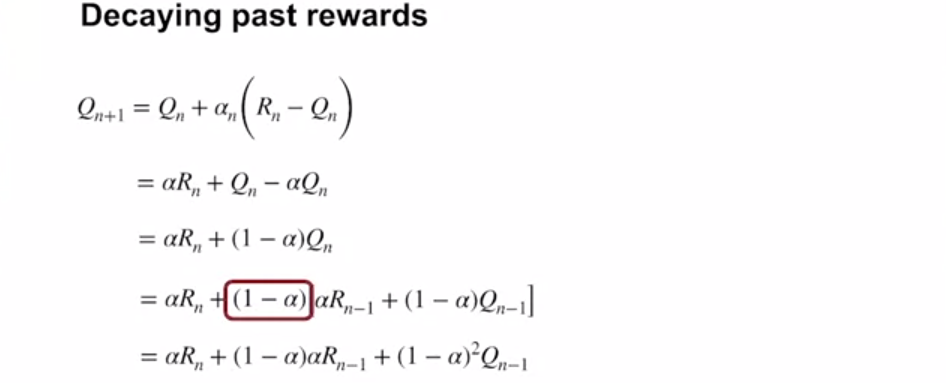
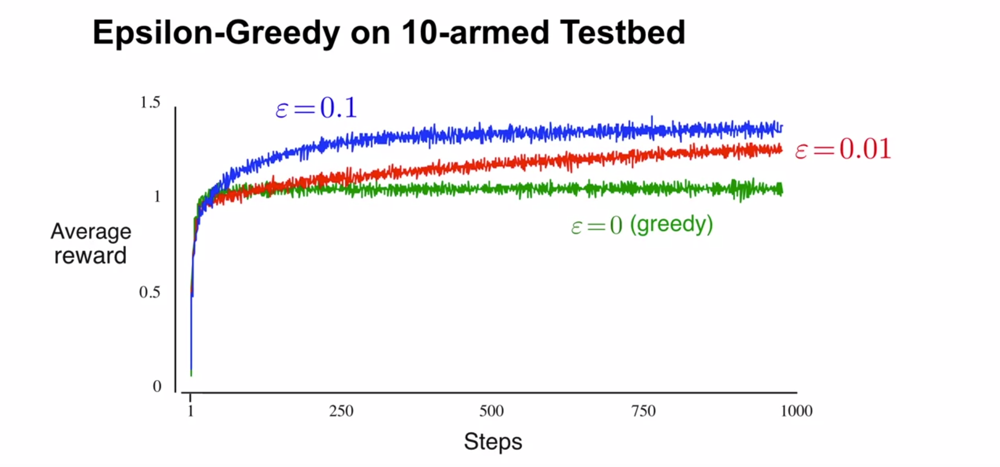
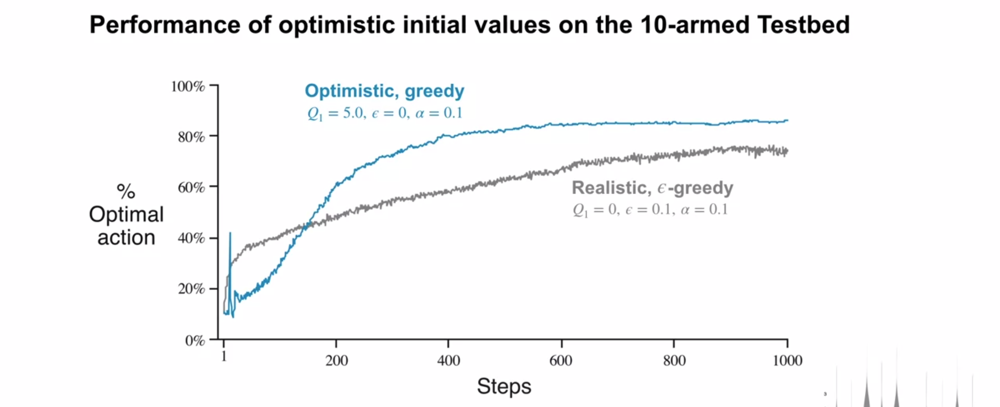
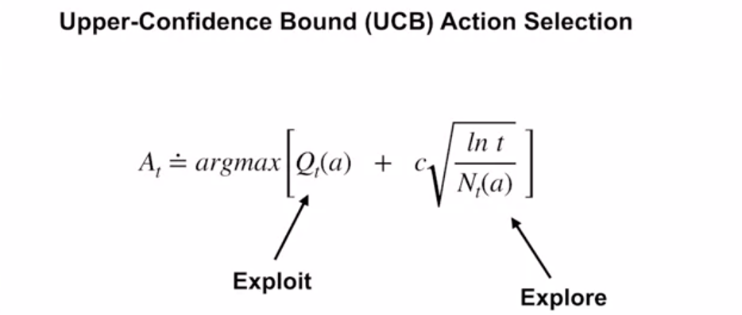
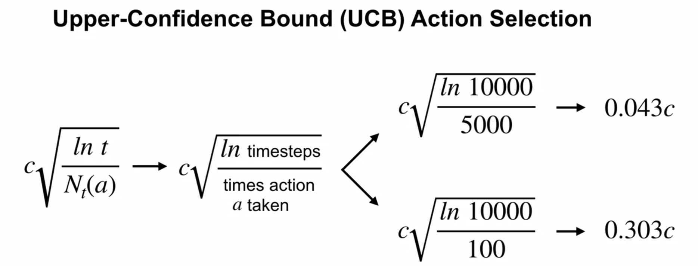
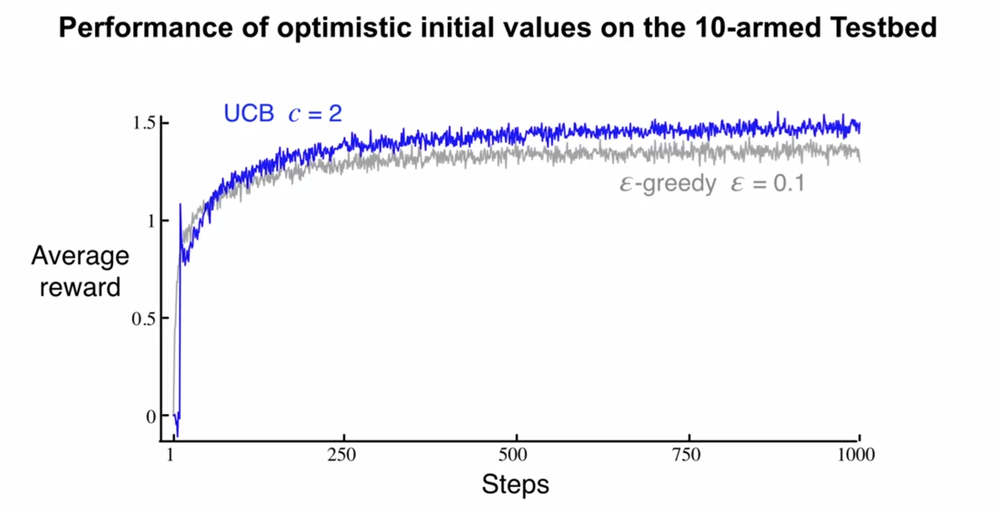
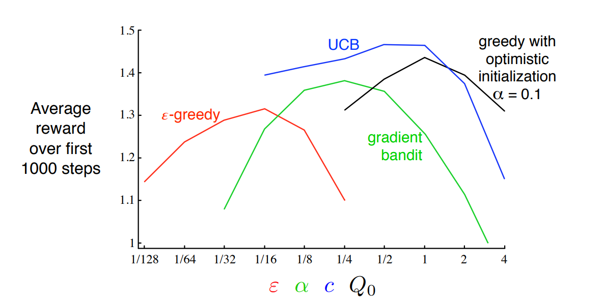

# Fundamentals of Reinforcement Learning
Week 1, Univerity of Alberta

[Textbook webpage](http://incompleteideas.net/sutton/book/the-book.html)

Notes
* [Zubieta's handwritten course notes](https://drive.google.com/file/d/1-QgHag8tGLf5rflYVQixIqhjdW8a-Hdt/view)
* [FrancescoSaverioZuppichini](https://github.com/FrancescoSaverioZuppichini/Reinforcement-Learning-Cheat-Sheet) Reinforcement Learning Cheat Sheet
* [yashbonde](https://yashbonde.github.io/musings.html) - Chapters 2-6, incl exercises
* [micahcarroll](https://micahcarroll.github.io/learning/2018/05/17/sutton-and-barto-rl.html) - Chapters 2 and 13
* [j-kan](https://observablehq.com/@j-kan/reinforcement-learning-notes) - Chapter 3 onwards
* [indoml](https://indoml.com/2018/02/14/study-notes-reinforcement-learning-an-introduction/#lstd) Most chapters, images generated from latex
* [nathandesdouits](https://github.com/nathandesdouits/reinforcement-learning-notes) 1st Ed. Chapter 2 & 3 with numpy code

Textbook solutions

* [yashbonde](https://yashbonde.github.io/musings.html) - Chapters 2-6, incl exercises
* [iamhectorotero - Chapter 1 to 3](https://github.com/iamhectorotero/rlai-exercises)
* [LyWangPX - Chapter 3 onwards](https://github.com/LyWangPX/Reinforcement-Learning-2nd-Edition-by-Sutton-Exercise-Solutions)
* [Weatherwax's 2008 solutions](http://fumblog.um.ac.ir/gallery/839/weatherwax_sutton_solutions_manual.pdf)

Possibly this:
https://towardsdatascience.com/the-complete-reinforcement-learning-dictionary-e16230b7d24e

## Course Introduction

Supervised learning: Labelled examples determine correctness of answer.

Reinforcement learning: Reward gives the agent some idea of how good or bad recent actions were.  Reward says what good behaviour looks like, not exactly how to solve the problem.

Unsupervised learning:  Extracting the underlying structure from data, the representation of the data.  Can assist in RL.

RL is about learning while interacting with an ever-changing world, refining behaviour as they go.

The 2 distinguishing features of RL are Trial-and-error search and delayed rewards.

Allowing for changing goals and integrating recent experience is important.

The defining feature and difficulty in RL is learning "online" (real-time) rather than just learning from data.

Weekly new algorithm improvements - breakneck pace.

The fundamentals of RL date back to Pavlov's drooling dogs.

At the heart of any RL system are ideas from one or two decades before now. DQN combines neural networks, Q learning, and experience replay

## Book notes

### 1.1 Reinforcement learning

Balancing exploration and exploitation only arises as a problem in RL.

Markov decision processes are are about how an agent acts given only:
* States
* Actions
* Rewards

All RL agents have explicit goals, can sense aspects of their environment and can choose actions to influence their environments.  There is an assumption that the agent needs to operate despite significant uncertainty about its environment.

RL includes SL, but for the specific purpose of determining which agent capabilities are critical and which are not.

### 1.3 Elements of RL

Four sub-elements of a RL system (beyond agent and environment):
1. Policy - determines the agent's next action based on what it senses and remembers of its environment
1. Reward signal - At each time step, a single number is sent from the environment and the objective is to maximise the total reward over the long run. Immediate reward.
1. Value function - the total of reward achievable, starting from a particular state. Long-term.
1. Model - allows inferences to be made about how environment will behave, and making of plans.

Achievable rewards are primary, while values are predictions of rewards, and thus secondary.  Values are based on rewards, and the point of estimating values is to achieve greater reward.

Values are most important though when making decisions, as they predict long-term reward.

Rewards are basically given directly from the environment, but values must be estimated and re-estimated as an agent learns about the rewards it has achieved.

The most important component of RL is estimating values.

## 1.4 Limitations and scope

We assume the state signal is produced by some pre-processing system that is nominally part of the agent's environment.

Book is concerned with deciding based on the available state, not determining the state signal itself.

Evolutionary methods (genetic algorithms/programming, simulated annealing) have advantages where the agent cannot sense the whole environment state, but these methods do not learn while interacting with the environment.

Model free methods have advantages where it's difficult to construct a sufficiently accurate model to be useful.  (1.5)

## 2. Multi-armed Bandits

RL *evaluates* actions taken, rather than SL's instructing independent of the action taken.

This chapter is about learning in a single situation, or a *nonassociative* setting.

2.1 $k$-armed bandits

Here the reward from each bandit is taken from a stationary probability distribution.

The value of an action is the mean or expected reward of taking that action.

If we knew $q_\star(a)$, we would always select the action with the highest reward. But we don't, so we continually refine estimates via $Q(a)$.

2.2 Action value methods

Action-value methods are ways of estimating values of actions and also using these estimates to decide on the action to take.

Near-greedy action selection is also known as $\epsilon$-greedy.

The probability of selecting the optimal action converges to $ \gt 1-\epsilon$, as it is the sum of the greedy $1-\epsilon$ and the exploratory $\epsilon \frac 1 k$.

### Instructors

Adam is well known for his work on predictive knowledge for reinforcement learning.

Martha's algorithm contributions to reinforcement learning are too many to list here. She has developed several new off-policy learning algorithms, new approaches to policy gradient, and dozens of impressive contributions to representation learning

RL is a generic approach to automated decision making.  It will likely really take off in industrial control systems.

### Specialisation roadmap

Course will closely follow Sutton & Barto's "Reinforcement Learning: An Introduction"

The RL book and this specialization adhere to a simple principle, introduce each idea in the simplest setting it arises

## Lesson 1: The K-Armed Bandit Problem

The agent learns it's own training data by interacting with the world, through trial and error.

Motivating Problem: Decision making under uncertainty with K-armed bandits.

In the k-armed bandit problem, we have a decision-maker or agent, who chooses between k different actions, and receives a reward based on the action it chooses.  Choosing an action yields an unknown reward.

### Sequential decision making with evaluative feedback

In the stationary version, each of our actions has an _expected reward_ given that that action is selected, called the _action value_.

$$\begin{align}
q_\star(a) & \doteq \mathbb{E}[R_t \mid A_t = a] \quad  \forall a \in \{1, …, k\} \\
  & = \sum_{r} p(r \mid a) \ r
\end{align}
$$

The conditional expectation is the sum of all possible rewards.

In the continuous case, switch the summation to an integral.

The goal of the agent is to maximise the expected reward by picking the corresponding action.  

Above, 1, 2, & 3 are the different treatments given, and the numbers are improvements in blood pressure.

### Learning action values

$q \star (a)$ is not known to the agent, so we must estimate it.

One way is via the Sample-Average method:

$$ Q_t(a) \doteq \frac{\text{sum of rewards when action `a` taken before time } t}{\text{number of times action `a` was taken prior to } t} $$

Sample-average is set to $0$ if the action hasn't yet been taken.

The greedy action is the one that currently has the largest estimated value.  The agent is exploiting its current knowledge for immediate return.

Alternatively, the agent could perform a non-greedy action, sacrificing immediate reward hoping to gain more information about the value of the other actions, and find a overall better action.

### Estimating action values incrementally

Book, $\S$2.4: To simplify notation we concentrate on a single action. Let $R_i$ now denote the reward
received *after* the $i$-th selection of this action, and let $Q_n$ denote the estimate of its action
value *after* it has been selected n-1 times.

This means that after selecting an action 2 times ($R_2$), $Q_3$ is the **expected** action value before selecting the action the 3rd time.  So Q_1 is observed when an action has been taken 0 times.

Observe $Q_t$, take $a_t$, get $r_t$, update $Q_{t+1}$.

Note that the definition is for $Q_{n+1}$, so it's purpose is to inform the next action, based on the sample-average that has been calculated from the rewards received $n$ times already.

Understanding: the incremental update rule expands the previous average by weight ($n-1$) and the current observation by $1$, then divides by $n$ to get the new average.

The incremental update rule can be written recursively:

$$\begin{align}
Q_{n+1} &= \frac{1}{n} \sum_{i=1}^n R_i \\
& = \frac{1}{n} \Bigg(R_n + \sum_i^{n-1} R_i\Bigg) \\
& = \frac{1}{n} \Bigg(R_n + (n-1) \frac{1}{(n-1)}\sum_i^{n-1} R_i\Bigg) \\
&= \frac{1}{n} \Big(R_n + (n-1) Q_{n}\Big) \\
&= Q_n + \frac{1}{n} \Big[R_n - Q_{n}\Big]
\end{align}$$

In final form, it takes the difference between the old average and the new observation, and weights it by $1 \over n$ before adding it to the mix.

This still works correctly after the initial action, setting $Q_2$ to be $R_1$ by cancelling the initial state:
$Q_2 = Q_1 + \frac 1 1 [R_1 - Q_1]$)

[//]: # (   Same as above math)

In a more general form:

NewEstimate $\gets$ OldEstimate + StepSize (Target - OldEstimate)

(Target - OldEstimate) is called the *error* in the estimate, reduced by taking a step toward the Target.  (Target is assumed to indicate a desirable direction to move, even if noisy.)

In the general case, the update rule is:

$Q_n + \alpha \Big[R_n - Q_{n}\Big] \quad$ Where $\alpha \rightarrow [0,1]$.

In the specific case of sample-average, we set $\alpha = \frac{1}{n}$.  If set to a constant, the estimate will never completely converge, but vary in response to the most recently received rewards, which is generally desired in the non-stationary case.

#### Non-stationary problems

Rather than using an average, non-stationary bandit problems have the distribution of rewards changing over time.

If we set a constant StepSize parameter $\alpha \in (0, 1]$, say 0.1, then the most recent rewards affect the action-value estimate more than the earlier ones. (Exponential time decay)

(Ignore the red here)… Continued... 

In the final sum when $i=n$, because $(1-\alpha)^0 = 1 $ becomes simply $\alpha R_n$.

The weight given to $R_i$ is based on how many rewards ago ($n-i$) it was observed. $n-n$ means the latest observation, and in this case there is no reduction of $\alpha R_i$ by the $(1-\alpha)^0$ term (which term is < 1 so reduces with exponentiation).

If $\alpha = 1$, then all the weight is assigned to the very last reward because of the convention of $0^0 = 1$.

This is called a weighted average because the sum of all weights to $Q$ and $R$ is $1$.  Also called a *recency weighted average*.

The first term shows the influence of the initialisation of $Q$ approaches 0 with more and more reward data.

Book $\S$2.6:  Using the initial definition for $Q_{n+1}$ in the slide above, we can set the $\alpha$ term instead to: $\beta_n \doteq \frac{\alpha}{\bar{o}_n}$, where:

$\bar{o}_n \doteq \bar{o}_{n-1} + \alpha(1 - \bar{o}_{n-1})$

This is an exponential recency-weighted average *without initial bias*.

### Exploration vs Exploitation tradeoff

We cannot do both simultaneously:

* Exploration - *improve* estimated action values ($Q$), hopefully leading to *long-term* benefit
* Exploitation - *use* estimated action values, hopefully maximising *short-term* reward

#### Random choice

Epsilon-greedy: We could roll a die and chose to explore iff we get a 1, else exploit.  $\epsilon = \frac 1 6$.

This result says "This way of behaving obtains this much reward in expectation across possible stochastic outcomes.

We use average performance over many independent runs to make scientific comparisons.

$\epsilon = 0.01$ explores only 1% of the time, and converges to taking optimal action 99.1% of the time.  99% is the greedy choice, and the .1 comes from the 1 in 10 chance of performing the best action choosing 10-armed random-uniform in exploration.

$\epsilon = 0.1$ learns faster, but plateaus after about 300 steps.

### Optimistic initial values

Optimistic initial values encourage early exploration by the initial reward being higher than any possible actual reward.

The followed paths then get downgraded toward their actual value, one at a time, meaning that all are explored initially, and the ones that work continue to be used as their value remains higher.

#### Limitations

Optimistic initial values only drive early exploration, which means the agent will not explore after a while.

This means that they are not suited to non-stationary problems - after a while an agent will have settled on a particular action and will not notice that a new one is better.

We may not know what the maximum reward is in order to be able to set a higher initial optimistic reward.

### Upper Confidence Bound (UCB) Action Selection

Instead of exploring uniformly, we can use uncertainty in estimates to explore in a more intelligent way.

The confidence interval between the lower bound and upper bound represents our uncertainty (small means confident).

UCB follows optimism in the face of uncertainty, choosing the action with the highest upper bound.

Either the highest UCB action:
* has highest value and we bank good reward
* we learn about the action that we know least about (UCB was highest because massive uncertainty)

We take the initial estimated value, and add an amount for exploration, where $c$ controls the amount of exploration.

The more times $a$ is selected, the greater the denominator, and smaller the UCB.

Conversely, if $t$ increases without $a$ being selected, the UCB increases. $ln(t)$ is unbounded, so all actions will eventualy be selected, but those selected frequently or with low estimates will be selected with decreasing frequency over time.

Note that UCB's exploration reduces over time, whereas $\epsilon$-greedy still continues exploring to its detriment.

UCB often performs well but is more difficult than $\epsilon$-greedy to extend to more general reinforcement learning problems.

### Gradient bandit algorithm

We can select the most preferred action based upon a softmax:

$$Pr\{A_t=a\} \doteq \frac{e^{H_t(a)}}{\sum_{b=1}^{k}e^{H_t(b)}} \doteq \pi_t(a)$$

One interesting property of the softmax (Ravi verified) is that softmax of vector $v$ is the same as softmax of $v + 10$ (element wise).

Where $H_1(a) = 0$. This is useful as the only thing required for any situation is the relative preference over the other possible actions. The equation for stochastic gradient ascent is given as:

$$H_{t+1}(A_t) = H_t(A_t) + \alpha(R_t - \bar{R_t})(\mathbb{1}_{a = A_t} - \pi_t(a))$$

$\bar R$ is the average of all rewards up to but not including time $t$, and serves as a baseline - if $R_t$ is higher, the probability of action $A_t$ is increased, and vice versa.

### Contextual bandits for real world learning

Real-world online and interactive learning, rather than a model that is trained then deployed without the possibility to change.

Jonathan Langford says that in general, contextual bandits is how RL is deployed in the world these days.

The observations of the real world are often different to simulators, leading to a different action, even given the same policy.  The reward is often not similar to the simulation, also.

Given the previous paragraph, there is a divergence between simulated performance and real-world performance. Applicability to real world applications is unclear and sometimes not possible.

How then to do real-world RL?

Statistical efficiency - there's a limited number of examples, and they need to be used to the greatest effect (vs unlimited examples in simulation)

State could be millions of pixels, but features are about what's important to make decisions.

Off policy evaluation necessary for real-world.  In Contextual Bandits, some algorithms just do learning, and some also as a byproduct produce data supporting off-policy evaluation.

After running for a long time, the simulation cares about the last policy.  IRL, every policy is important, and may be based on individual users.

* [Tutorial on Contextual bandits](https://hunch.net/~rwil/)
* [Vowpal Wabbit](https://github.com/VowpalWabbit/vowpal_wabbit) code to do Contextual Bandits
* [Asure personalizer](aka.ms/personalizer)  Azure's version

Nonassociative tasks: ones where there is no need to associate different actions with different situations. So far, the learner tries to find the best action (if stationary), or track the best action with time.

However, generally there is more than one situation, and the best approach is to learn a policy, mapping from situations to the best actions.

Imagine that there are multiple $k$-armed bandits, and at each time the one presented changes at random, along with a clue as to its identity (but not action values).

This is an example of an *associative search* task, as association of actions to the situations in which they are best is also involved, in addition to finding the best actions.  These are called contextual bandits.

Contextual bandits are intermediate between the $k$-armed bandit and the full reinforcement learning problem as a policy is required, but each reward is still immediately assigned after an action.  Actions still don't affect the next situation.

### Summary

[//]: # (This may be the most platform independent comment)
