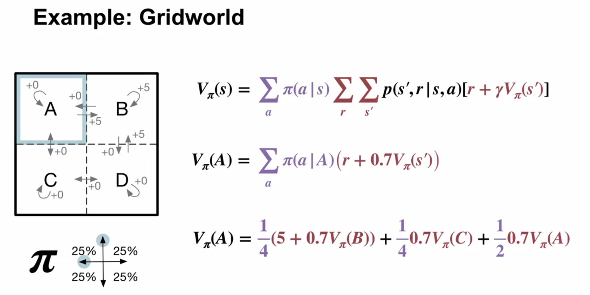
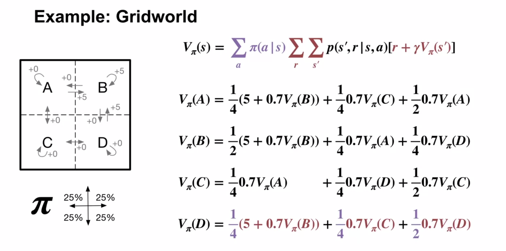
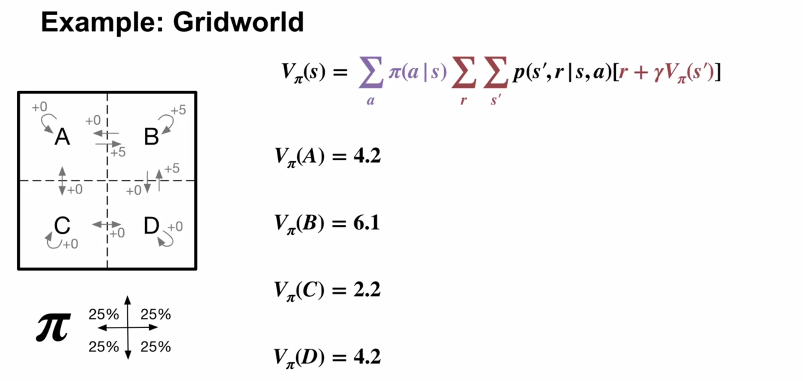
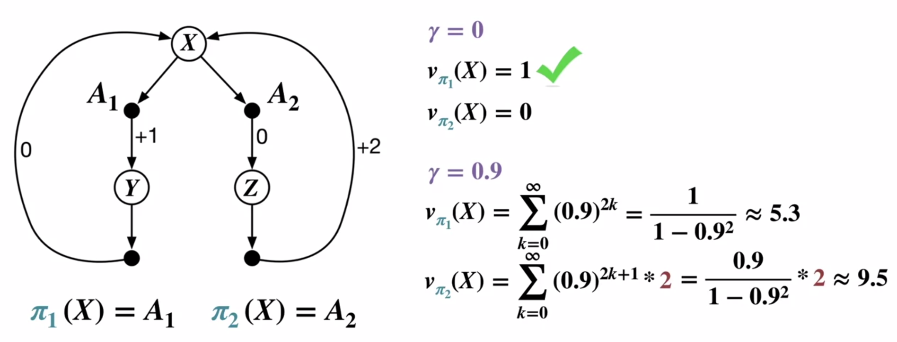
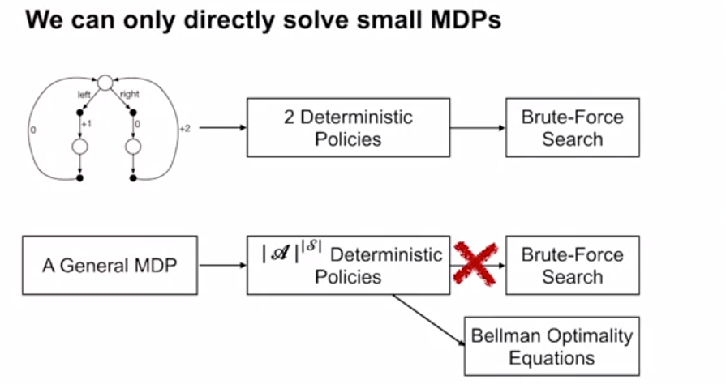
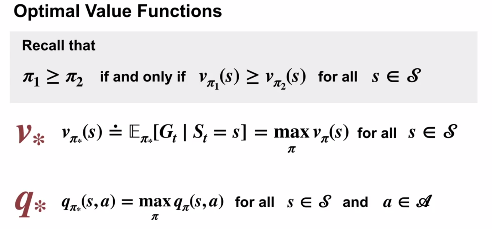
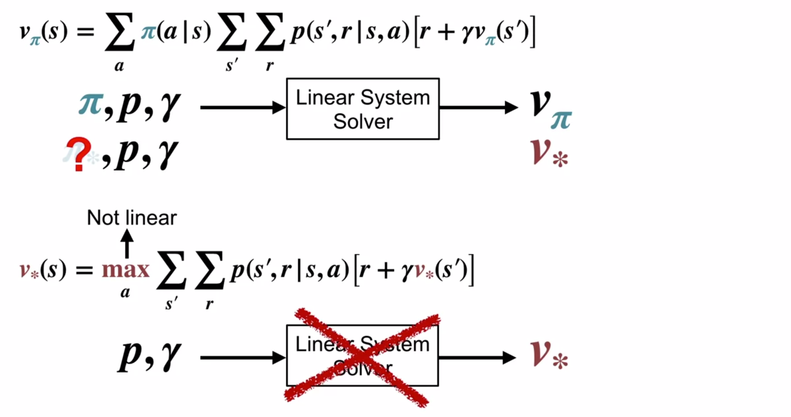
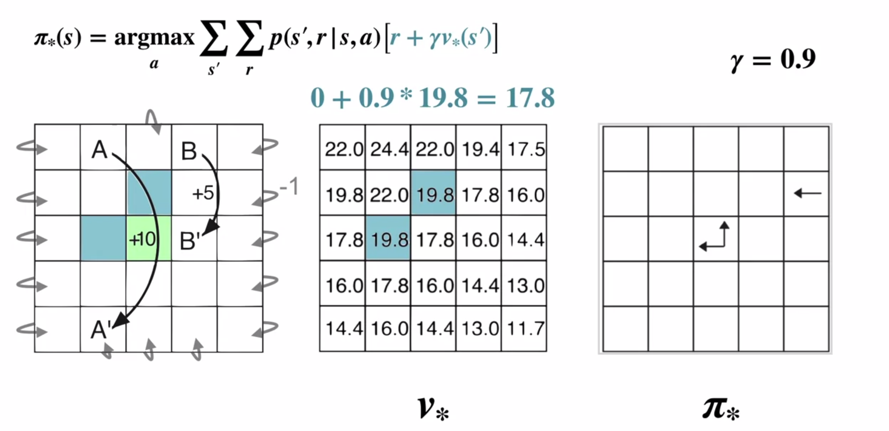

# Week 3: Value Functions and Bellman Equations

## Value functions

The action value of a state is the expected return if the agent selects a given action, and then follows policy.

A value function summarises all possible futures by averaging over their returns.

### Brief history of RL

Marvin Minsky 1959/60.  Harry Klopf recognised adaptive behaviour was being ignored as the focus had shifted to supervised learning.

The first digital neural network simulation by Farley and Clark (1954) was a RL system.  Their next paper Clark and Farley moved away from the roots of their original idea, and then by the time of the perceptron, the focus was on error correction.

Particularly influential was Minsky’s paper “Steps Toward Artificial Intelligence” (Minsky, 1961), which discussed several issues relevant to trial-and-error learning, including prediction, expectation, and what he called the basic credit-assignment problem for complex reinforcement learning systems: How do you distribute credit for success among the many decisions that may have been involved in producing it? All of the methods we discuss in this book are, in a sense, directed toward solving this problem. Minsky’s paper is well worth reading today.

Minsky's thesis at Princeton was a RL physical system about a maze [SNARC](http://cyberneticzoo.com/mazesolvers/1951-maze-solver-minsky-edmonds-american/)

Barto and Sutton wrote papers on assocative search networks (combination of association and trial and error).  Search for something that works and then remember it.  Memoisation - remember the result from last time rather than having to recompute it.

RL at its roots is memoised context-sensitive search.

Harry Klopf had the idea of a distributed approach - [goal-seeking systems made up of goal-seeking components](https://dl.acm.org/doi/epdf/10.1145/1045236.1045237).
Generalised reinforcement - a unit could be reinforced by many types of signal.

Barto and Sutton disposed of one of the two core ideas of Klopf: that goal-seeking systems need to be made out of goal-seeking components.

### Bellman equations

These allow us to express a state-value or action-value in terms of their successors.

We can use the recursive definition as neither $\pi$ nor $p$ depend on time.

The magic of value functions is that they can be used as a stand-in for the average of an infinite number of possible futures.

### Why Bellman equations?

Above, transitions into state $B$ give +5 reward.

Policy is uniform random U,D,L,R movement.

The value function is the expected return under policy $\pi$: an average over the return obtained by each sequence of actions that an agent could possibly choose (in infinitely many possible futures).

We can remove the sum over $r$ and $s'$ as for each action there is only one next state and reward.

In the 2nd equation, $s'$ and $r$ still depend on $s$ and $a$, but for notational simplicity this has been omitted.

The value of each variable can be found as this is a system of 4 linear equations with 4 variables.

The Bellman equation reduced an unmanageable infinite sum over possible futures into a tractable algebra problem.

Bellman equations can be used for moderate sized MDPs, but are not practical for larger MDPs.

Later we learn algorithms based on Bellman equations which can scale up to large problems.

### Optimal policies

The goal of RL is to find an optimal policy - the one which finds maximum reward in the long run.

The line shouldn't be continuous as states are discrete not continuous, nor will the values change  smoothly across states.

Different policies will value states differently.

$\pi_1 \ge \pi_2$ or "$\pi_1$ is good as or better than $\pi_2$" means that for each state, $\pi_1$ gives a value $\ge$ $\pi_2$.

There's always at least one optimal policy, but possibly more than one.

Policies can be combined to create a new meta-policy such that for each state, the best policy is selected.  Such a meta-policy is called an optimal policy, or $\pi_*$.

The optimal policy can have state values strictly greater than the individual policies it is created from, as the overall area under the curve is greater.

An optimal policy can ensure that it maximises return at every single time step, meaning that in the Bellman state-value equations, the probability weighting given by $\pi_*(a|s)$ will be maximum $=1$ for an action giving highest (or equal-highest) return. (Recall this probability was 0.25 in the Gridworld non-optimal policy example). In the Bellman state-value equation, the probability of $1$ is then multiplied by a maximum expected return (also discounted returns are added).  This will create state-values greater than an individual policy in the case where the best individual policy's probability of transition to the highest reward state was lower than $1$.
[(my answer posted here)](https://www.coursera.org/learn/fundamentals-of-reinforcement-learning/discussions/weeks/3/threads/W6aZN8TPEemx-wqBHs6BaA/replies/utda3pqXQ5KXWt6alwOSLg)

There are only 2 deterministic policies which are determined by the choice made in state $X$.

$\gamma^{2k}$ comes from every odd power of $\gamma$ being multiplied by 0.  $\gamma^{2k+1}$ comes from every even power of $\gamma$ being multiplied by 0.

The exponential number of possible policies makes brute force search intractable.

### Optimal value functions

The Bellman optimality equations relate the value of a state or state-action pair to its possible successors under any optimal policy:

The sum over $\pi_*(a|s)$ can be exchanged with selection of the optimal action, as $\pi_*$ will only select (one of) the optimal action(s). (All other actions are assigned probabilty $0$.)

In the top half, the non-optimal Bellman equations can be solved via a system of equations, given $\pi, p, \gamma$.

We can't use $\pi_*$ (under the red '?') in the ordinary Bellman equation to get a value for $v_*$ because we don't know $\pi_*$ (which is the goal of RL).

The Bellman optimality equations give a similar system of equations for the optimal value.  However, getting the maximum over actions is not a linear operation, so linear algebra techniques won't help.

In this course we won't form and solve these equations in the usual way, rather we'll use other techniques based on the Bellman equations to compute value functions and policies.

If we can solve or approximate the Bellman optimality equation for $v_*$, we can use the result to obtain $\pi_*$ fairly easily.

### Using optimal value functions to get optimal policies

Given an optimal value function, it's quite easy to find an associated optimal policy.

Unlike the uniform random policy, the optimal policy won't ever choose to bump into the walls, so the bottom row doesn't have negative values.  As a consequence, the immediate reward of state $A$ is much higher than +10.

To evaluate the boxed term for a given action, we only need to perform a single step lookahead at the next states and values that follow.  The branching after the action (below the solid circle) shows captures stochastic transitions to next states.

In this example, each action leads us deterministically to a single next state and reward.

We consider the square in green.  Given two equal maximum values, an optimal policy is free to pick either up or left with some probability.

We have also verified that $v_*$ obeys the Bellman optimality equation: for the maximising actions, the RHS of the blue equation evaluates to 17.8, equal to the value for the state itself.

The action value function $q_*$ caches the results of a one step lookahead for action $a$ in state $s$.

If we have access to $q_*$, it's even easier to come up with the optimal policy:  there's no one-step lookahead, just choose the action which maximises $q_*$ given $s$.

Finding an optimal action-value function corresponds to finding an optimal policy.

### Summary

A deterministic policy has probability $1$ of selecting a single action given a state.

Value functions simply things by summarising many possible future returns into a single number.

$q_\pi$ is the value of selecting $a$, then afterwards following $\pi$.

The Bellman state-value equation gives the value of a state as a sum over the values of all successor states and intermediate rewards.

The Bellman action-value equation gives the value of a state-action pair as a sum over the immediate rewards and values of all possible next state-action pairs (with their included rewards).

To find a policy which maximises reward, we define:
* Optimal policies
* The optimal value function
* Bellman optimality equations

An optimal policy achieves the highest value possible in every state.  There is always *at least* one optimal policy.

Every optimal policy shares the same optimal state-value and action-value functions.

[Ignore the space in the above 2nd equation]

The Bellman optimality equations replace referencing a specific policy with a max over all actions, since the optimal policy must always select a best available action.

We can extract the optimal policy from the optimal state-value policy, but we also need the one-step dynamics of the MDP.

We can get an optimal policy with much less work from the optimal action-value function by selecting the action with highest value in each state.

Next week:  How to compute optimal policies using Bellman's equations.

### 3.4 Unified Notation for Continuing and Episodic Tasks

$$G_t \doteq \sum_{k=0}^{\infty}{\gamma^{k}R_{t+k+1}} = \sum_{k = t+1}^{T}{\gamma^{k - t - 1}R_{t}}  $$

This holds true for both $T = \infty$ and $\gamma = 1$, but not both.

### 3.5 Policies and Value Functions

State-value function for policy $\pi$:

$$\displaystyle v_\pi(s) \doteq  \mathbb{E}_{\pi}[G_t|S_t = s] \ = \ \mathbb{E}_{\pi}\left[\sum_{k = 0}^{\infty}{\gamma^k R_{t+k+1}\Big|S_t = s}\right]$$

Action-value function for policy $\pi$  (action $a$ is taken, thereafter $\pi$ is followed:

$$\displaystyle q_\pi(s,a) \doteq \mathbb{E}_{\pi}[G_t, S_t = s, A_t = a] \ = \ \mathbb{E}_{\pi}\left[\sum_{k = 0}^{\infty}{\gamma^k R_{t+k+1}\Big|S_t = s, A_t = a}\right] $$

Ex 3.11:

$$ \mathbb{E}[R_{t+1}|s=S_t,\pi,p] = \sum_{a \in A} \pi(a|s) \cdot r(s,a) = \sum_{a \in A} \pi(a|s) \sum_{r\in R}r\sum_{s'\in S}p(s',r|s,a) $$

Ex 3.12: Give an equation for $v_\pi$ in terms of $q_\pi$ and $\pi$:

$$ v_\pi(s) = \sum_{a \in \mathbb{A}(s)}{\pi (a|s)\ q_\pi(s,a)} $$

Ex 3.13: Give an equation for $q_\pi$ in terms of $v_\pi$ and the four-argument $p$:

$$ \begin{align}
q_\pi(s,a) &= r(s,a) + \gamma v_\pi(s') \\
&= \sum_{r\in R}r\sum_{s'\in S}p(s',r|s,a) + \gamma \sum_{r \in R} p(s',r|s,a)\  v_\pi(s')
\end{align}$$

"Monte Carlo" methods involve averaging over many random samples of actual returns.

#### Bellman equations

A recursive definition of $v_\pi(s)$ is, for all $s \in \mathcal S$:

$$ \begin{align} v_\pi(s) &\doteq \mathbb{E}[G_t \mid S_t = s] \\
&= \mathbb{E}[R_{t+1} + \gamma G_{t+1}  \mid  S_t = s] \\
&= \sum_{a} \pi(a|s) \sum_{s', r} p(s',r|s,a) \Big[r + \gamma\mathbb{E}_\pi\left[G_{t+1} \mid S_{t+1} = s'\right]\Big] \\
&= \sum_{a} \pi(a|s) \sum_{s', r} p(s',r|s,a) \Big[r + \gamma v_\pi(s')\Big] \tag{3.14}
 \end{align}$$

The final expression can be read easily as an expected value. It is really a sum over all values of the three variables, $a$, $s'$, and $r$.

For each triple, we compute its probability, $\pi(a|s)\ p(s',r|s,a)$, weight the quantity in brackets by that probability, then sum over all possibilities to get an expected value.

A recursive definition of $q_\pi(s,a)$ is, for all $s \in \mathcal S$:

$$ \begin{align}
q_\pi(s,a) &= \mathbb{E}[R_{t+1} + \gamma G_{t+1} \mid S_t = s, A_t = a] \\
&= \sum_{s', r} p(s',r|s,a)  \Big[ r + \gamma \ \mathbb{E}_\pi\left[s' \right] \Big] \\
&= \sum_{s', r} p(s',r|s,a) \left[ r + \gamma \sum_{a'} \pi(a'|s') \ q_{\pi}(s', a') \right] \\
 \end{align}$$

The final equation replaces the expected value of $s'$ with the action-values 

Both equations produce a set of linear equations, solvable for actual values.

Ex 3.15: If adding constant $c$ to each reward in a continuing task:

$$ \begin{aligned}
G_t &= (R_{t+1}+c) + \gamma (R_{t+2}+c) + \gamma^2 (R_{t+3}+c) + ... 	\\
    &= \sum_{k=t+1}^{\infty} \gamma^{k-t-1} R_{t} + \sum_{k=0}^T \gamma^k c \\
    &= \sum_{k=t+1}^{\infty} \gamma^{k-t-1} R_{t} + \frac{c}{1-\gamma}
\end{aligned}$$

Then each state's reward is increased (or decreased if negagtive) uniformly by the constant $\frac{c}{1-\gamma}$.  The descending ordering of states by reward under any given policy will remain the same, so the optimal actions under that policy won't change.

Ex 3.16: What if it's an episodic task?

Adding a positive constant will make longer episodes more advantageous, adding a negative constant will make shorter episodes more advantageous.

Ex 3.17

$$ \begin{align}
q_\pi(s,a) &= \mathbb{E}_\pi\left[G_t | S_t = s, A_t = a \right] \\
&= \sum_{s',r} p(s',r|s,a) \left[r + \gamma \ v_\pi(s')\right] \\
&= \sum_{s',r} p(s',r|s,a) \left[r + \gamma \sum_{a'}\mathbb{E}[G_{t+1}|S_{t+1} = s']\right] \\
&= \sum_{s',r} p(s',r|s,a) \left[r + \gamma \sum_{a'}\pi(a'|s')q_\pi(s',a')\right] \\
\end{align}$$

Ex 3.18

$$v_\pi(s) = \sum_{a \in A} \pi(a|s) q_\pi(s,a)$$

Ex 3.19

$$ \begin{align}
q_\pi(s, a) &= \mathbb E\left[R_{t+1}\right] + \gamma \mathbb E \left[v_\pi(S_{t+1})\right] \\
&= \sum_{s',r} r \cdot p(s',r|s,a) + \gamma \ v_\pi(s')
\end{align}$$

### 3.6 Optimal Policies and Optimal Value Functions

Optimal policies share the same optimal state-value function, denoted $\displaystyle v_*(s)$, defined as:

$\displaystyle v_*(s) \doteq \max_{\pi} v_\pi(s) \quad \forall s \in \mathcal S$

The Bellman optimality equation expresses the fact that the value of a state under an optimal policy must equal the expected return for the best action from that state.

The beauty of $v_*$ is that a greedy, one-step-ahead search yields the long-term optimal actions.

$$ \begin{align}
v_*(s) &= \max_{a} \mathbb{E}\left[ R_{t+1} + \gamma v_{*}(S_{t+1}) | S_t = s, A_t = a\right] \\
&= \max_{a} \sum_{s', r}p(s',r|s,a) \left[ r + \gamma v_{*}(s')\right] \tag{3.19}\\
\end{align}$$

For optimal actions, we have $q_*$ which "caches" the results of one-step-ahead searches, so only the action which maximises $q_*$ need be selected for an optimal policy.

At the cost of representing a function of state–action pairs, instead of just of states, the optimal action-value function allows optimal actions to be selected without having to know anything about possible successor states and their values, that is, without having to know anything about the environment’s dynamics.

$$ \begin{align}
q_*(s,a) &= \mathbb{E} \left[R_{t+1} + \gamma \max_{a'} q_*(S_{t+1}, a') \big| S_t = s, A_t = a \right] \\
&= \sum_{s',r} p(s',r|s,a) \left[r + \gamma \max_{a'}q_*(s',a')\right] \tag{3.20}
\end{align}$$

The Bellman optimality equation is actually a system of equations, one for each state, so if there are N states, then there are N equations in N unknowns. If the dynamics of the environment are known, then in principle one can solve this system of equations for the optimal value function using any one of a variety of methods for solving systems of nonlinear equations. All optimal policies share the same optimal state-value function.

Any policy that is greedy with respect to the optimal evaluation functions $v_*$ or $q_*$ is an optimal policy.

$\pi_*$ assigns non-zero probability only to actions that are equal-maximum reward.

Bellman optimality solutions rely on at least three assumptions that are rarely true in practice:

1. We accurately know the dynamics of the environment
2. We have enough computational resources to complete the computation of the solution
3. The Markov property

This solution is rarely directly useful. It is akin to an exhaustive search, looking ahead at all possibilities, computing their probabilities of occurrence and their desirabilities in terms of expected rewards.

However, many reinforcement learning methods can be clearly understood as approximately solving the Bellman optimality equation, using actual experienced transitions in place of knowledge of the expected transitions.

# 3.7 Optimality and approximation

For the kinds of tasks in which we are interested, optimal policies can be generated only with extreme computational cost.

In many cases of practical interest, there are far more states than could possibly be entries in a table. In these cases the functions must be approximated, using some sort of more compact parameterized function representation.

The online nature of reinforcement learning makes it possible to approximate optimal policies in ways that put more e↵ort into learning to make good decisions for frequently encountered states, at the expense of less effort for infrequently encountered states. This is one key property that distinguishes reinforcement learning from other
approaches to approximately solving MDPs.

$$ \begin{align}
\end{align}$$

# Add exercies up to approx 3.29.

[//]: # (This may be the most platform independent comment)
