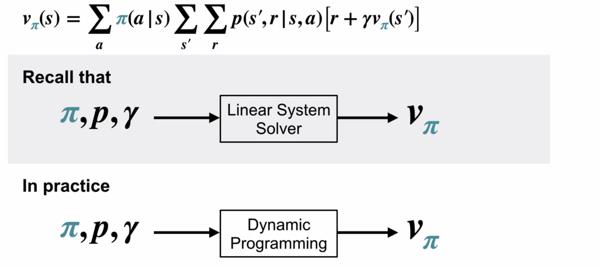
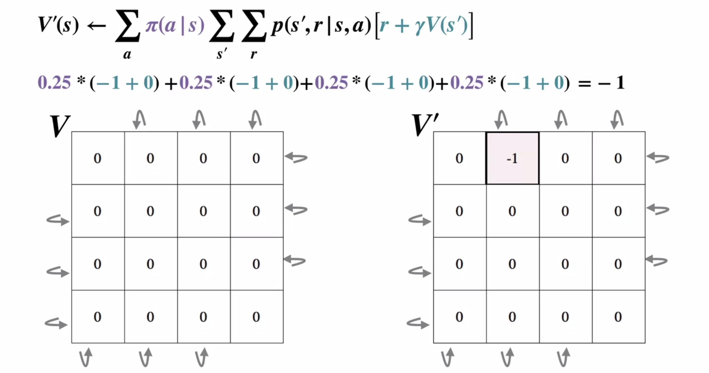
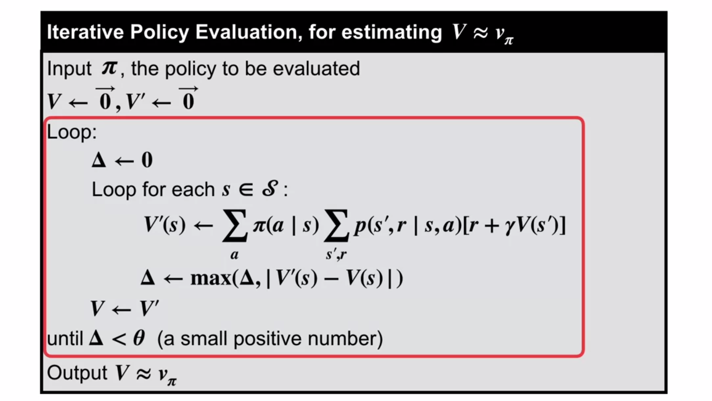
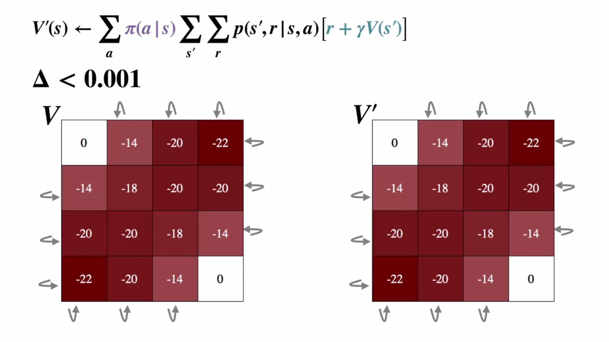
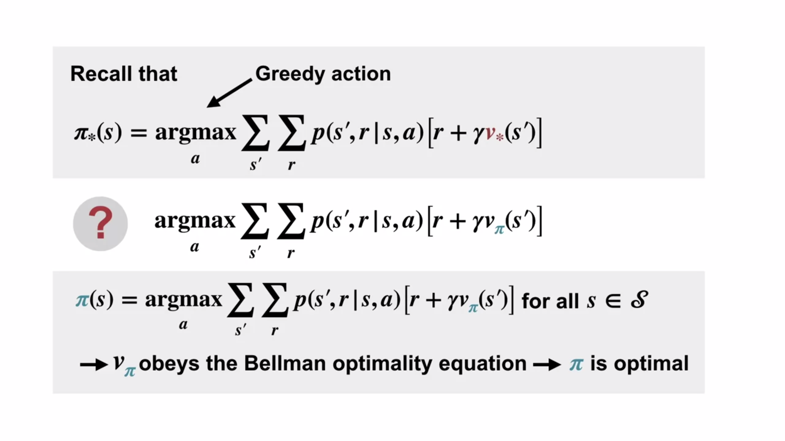
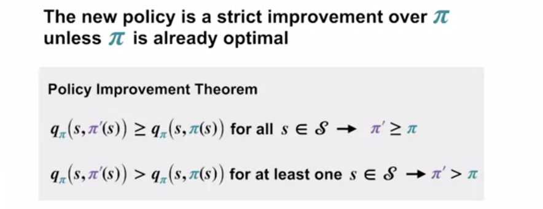
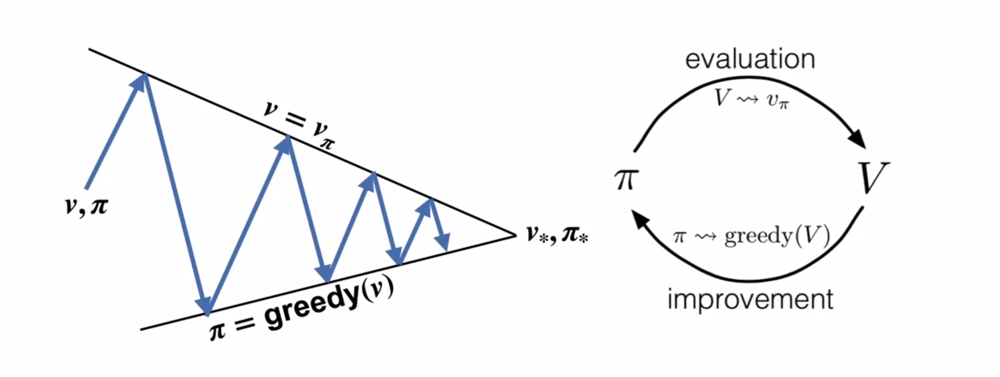
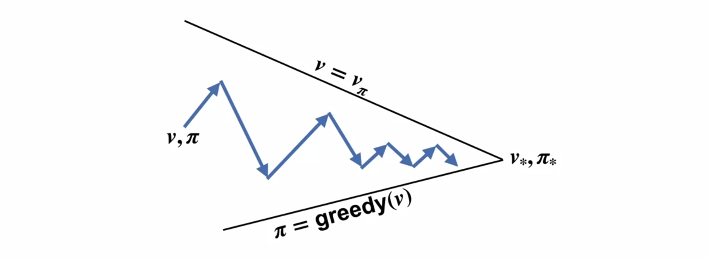
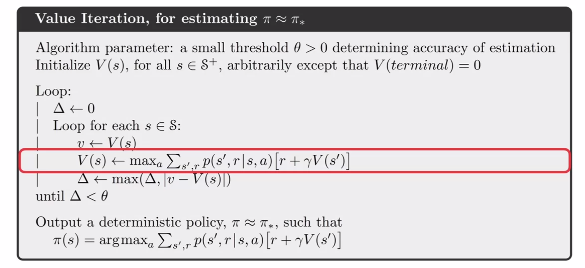

# Week 4: Dynamic Programming

## Learning objectives

### Lesson 1: Policy Evaluation (Prediction)

Policy evaluation is the task of determining the value function for a given policy.

Control is the task of finding a policy which gives as much return as possible (ie, maximises the value function).

Control is the ultimate goal of RL.  Policy evaluation is usually a necessary first step - it provides a metric for improvement.

Dynamic Programming solves both policy evaluation and control problems.

#### Understand the distinction between policy evaluation and control

Dynamic Programming uses the Bellman equations to define converging algorithms for policy evaluation and control.

Policy evaluation is the task of determing $v_\pi$ for a given policy $\pi$.

The Bellman state equation reduces the problem of finding $v_\pi$ to a system of linear equations, one for each state.

"Strictly better" when comparing policies means that the area under the state-value plot is greater:
* The policy is "as good as or better" (meaning across all states), and:
* There is at least one state where the value is greater and not equal.

The goal of the control task is to modify a policy to produce one which is strictly better.

When this is no longer possible, it means there is no policy strictly better than the current policy, meaning the current policy is an optimal policy.

#### Explain the setting in which dynamic programming can be applied, as well as its limitations

Classical Dynamic Programming doesn't involve environment interaction (trial-and-error learning), it assumes complete knowledge of the MDP via $p$.

It uses the 4 Bellman equations with $p$ to iteratively work out value functions and optimal policies.

Most other RL methods can be seen as an approximation to Dynamic programming without $p$.  The difference is probably most striking in the temporal-difference based dyna-planning algorithm covered in course 2.

Dynamic programming solves both policy evaluation and control if we have access to the model's dynamics, $p$.

#### Outline the iterative policy evaluation algorithm for estimating state values under a given policy

Dynamic programming algorithms come from turning the Bellman equations into update rules.

Instead of an equation that holds for the true value funciton, we have a procedure that we can apply until the equation holds.

A sweep is applying the above update $\forall s \in \mathcal S$.

Begin with an arbitrary initialisation for the value function, called $v_0$.  Each sweep of the update rule produces a better and better approximation of $v_\pi$.

When the update converges (the state-value function no longer changes),  then we have evaluated $v_\pi$ for the current policy $\pi$.  This is because $v_\pi$ is the unique solution to the Bellman equation.  The only way the update could not make a change is if $v_k$ already obeys the Bellman equation.

When $v_{k+1} = v_k$ (equality not assignment) for all states, then replacing both terms with $v_\pi$ gives us the Bellman equation, and therefore the state-value function for policy $\pi$.

#### Apply Iterative policy evaluation to compute value functions

Use two arrays:
1. $V$ stores the current state values
2. $V'$ stores the updated state values
3. Update $V$ with $V'$ after a full sweep.

Two arrays are used so that the new values can be computed from the old, without changing the old values in the process.

It's also possible to use a single array, in which case some updates will use new values.  This is still guaranteed to converge, and will in fact usually converge faster, as it gets to use the newer values sooner.

Terminal states are top left or bottom right squares, but formally both are the same state.  The value of the terminal state is defined to be $0$.

An action which would take the agent off the grid returns it to the same position.

If using the 2 array update, the $V'$ values are irrelevant as they will all be updated based on $V$ before use.

After convergence, it looks like:

### Lesson 2: Policy Iteration (Control)

#### Understand the policy improvement theorem

The Policy Improvement Theorem tells us that a greedified policy is a strict improvement (unless it was already optimal).

In the `?` or $\pi'$ case, we select the action which is greedy based on the current policy $\pi$, (because we don't yet know $\pi_*$).  We use $v_\pi$ as we don't yet know $v_*$.

The new policy must be different to $\pi$, else...

If greedy-fication doesn't change $\pi$, then $\pi$ was already optimal with respect to its value function, i.e. it was already an optimal policy.

#### Use a value function for a policy to produce a better policy for a given MDP

The new policy must be a strict improvement to unless the policy was already optimal.

#### Outline the policy iteration algorithm for finding the optimal policy

Above is the process for Policy Iteration.

Each policy is guaranteed to be an improvement on the last (unless the last was already optimal).

If each policy generated is deterministic, given that there are a finite number of deterministic policies, to the iterative improvement must eventually find an optimal policy.

#### Understand “the dance of policy and value”

1. Evaluate $\pi_1$ $ \rightarrow v_{\pi_1}$
2. Use $v_{\pi_1}$ to get $\pi_2$.  (Now $\pi_2$ is greedy w.r.t $v_{\pi_1}$, but $v_{\pi_1}$ no longer reflects $\pi_2$.)
3. Evaluate $\pi_2$ $ \rightarrow v_{\pi_2}$
4. Use $v_{\pi_2}$ to get $\pi_3$.  (Now $\pi_3$ is greedy w.r.t $v_{\pi_2}$, but $v_{\pi_2}$ no longer reflects $\pi_3$.)

This continues until we reach a policy which is greedy with respect to its own value function, namely an optimal policy.

Because each step of improvement moves in the direction of "better", the search space for policies is progressively narrowed.

#### Apply policy iteration to compute optimal policies and optimal value functions

Alternate between evaluation and improvement until the policy doesn't improve.

### Lesson 3: Generalized Policy Iteration

We don't need to strictly alternate between evaluation and improvement. Additionally, we can still retain optimality guarantees.

#### Understand the framework of generalized policy iteration

We don't need to iterate all the way to an accurate state-value function, or optimal policy.

#### Outline value iteration, an important example of generalized policy iteration

Value Iteration combines (greedy) policy evaluation and improvement into a single step.

In Value Iteration, we make passes over all the states, running only one step of (greedy) policy evaluation per state, and using the greedy value to update the state-value.

The algorithm doesn't reference any particular policy, hence the name "value iteration".

Instead of updating based on a fixed policy, we update based on the action that maximises the current value estimate.

#### Differentiate between synchronous and asynchronous dynamic programming methods

Synchronous methods sweep the entire state-space in each iteration.  This can be problematic if the state space is large.

Asynchronous methods may update a single state many times before another is updated once.

For convergence, asynchronous methods must continue to update the values of all states.

Selective updates allow asynchonous methods to propogate more quickly, e.g. by updating the states "nearby" those that have recently changed value.  This is useful when the state space is very large.

#### Describe Monte Carlo as an alternative method for learning a value function

We could take many different returns under $\pi$ and find their mean, which will eventually converge to the state-value.  We may need to average many returns before the estimate converges, and this would need to be done for every single state.

#### Describe Monte Carlo as an alternative method for learning a value function

We could take many different returns under $\pi$ and find their mean, which will eventually converge to the state-value.  We may need to average many returns before the estimate converges, and this would need to be done for every single state.

#### Describe brute force search as an alternative method for searching for an optimal policy

There are a finite number of deterministic policies, and there always exists (at least) one optimal policy.

If the policy space is small enough, then we could evaluate every policy one at a time, and pick the best one with the highest value.

A deterministic policy has one action choice per state, so the total number of deterministic policies is exponential in the number of states:  $|A|^{|\mathcal S|}$.

#### Understand the advantage of Dynamic programming and “bootstrapping” over Monte Carlo and brute-force

Dynamic programming's advantage is that we don't need to treat the evaluation of each state as a separate problem.  We can use the other state-value estimates that we've already worked hard to compute.

Using the value estimates of successor states to determine the current state's value is known as bootstrapping.  This can be much more efficient that estimating each state's value independently.

Policy Improvement Theorem guarantees that policy iteration will find a sequence of better and better policies, a significant improvement over an exhaustive search.

Policy Iteration is guaranteed to find an optimal policy in $\mathcal O(|\mathcal S| + |\mathcal A|)$.  (Exponentially faster than brute force = $|A|^{|\mathcal S|}$).

With each step of policy iteration, the values tend to change less and less.

### Curse of Dimensionality

The state space grows exponentially as the number of relevant features increases.

This is not an issue with Dynamic Programming, but rather an inherent complexity of real-world problems.

Various techniques for mitigating this curse exist, and we will continue to deal with it for the remainder of this specialisation.

### Warren Powell: Approximate dynamic programming for fleet management

We want to calculate the marginal value $\bar v$ of a single driver.  This is a linear programming problem, solvable by Gurobi and cplux.

Vector valued action spaces.

For each driver, we drop them out of the system and calculate the system's new value.  The difference in values between the original and driver $a$ dropped value is $\hat v(a)$.

The packages above give the $\hat v$ values for free.

### Quiz learnings

A value function is based on a policy.  If a policy is greedy w.r.t it's own value function, then it is an optimal policy (the value function reflects the always-greediness).

# Quiz
1. \>=
2. F
3. T
4. T
5. F
6. GPI only
7. All
8. F
9. T
10. Async
11. Model
12. 0
13. -15
14. -24

$$ \begin{align}
\end{align}$$

[//]: # (This may be the most platform independent comment)

# Deleteme:
[Textbook webpage](http://incompleteideas.net/sutton/book/the-book.html)

Notes
* [Zubieta's handwritten course notes](https://drive.google.com/file/d/1-QgHag8tGLf5rflYVQixIqhjdW8a-Hdt/view)
* [FrancescoSaverioZuppichini](https://github.com/FrancescoSaverioZuppichini/Reinforcement-Learning-Cheat-Sheet) Reinforcement Learning Cheat Sheet
* [yashbonde](https://yashbonde.github.io/musings.html) - Chapters 2-6, incl exercises
* [micahcarroll](https://micahcarroll.github.io/learning/2018/05/17/sutton-and-barto-rl.html) - Chapters 2 and 13
* [j-kan](https://observablehq.com/@j-kan/reinforcement-learning-notes) - Chapter 3 onwards
* [indoml](https://indoml.com/2018/02/14/study-notes-reinforcement-learning-an-introduction/#lstd) Most chapters, images generated from latex
* [nathandesdouits](https://github.com/nathandesdouits/reinforcement-learning-notes) 1st Ed. Chapter 2 & 3 with numpy code

Textbook solutions

* [iamhectorotero - Chapter 1 to 3](https://github.com/iamhectorotero/rlai-exercises)
* [LyWangPX - Chapter 3 onwards](https://github.com/LyWangPX/Reinforcement-Learning-2nd-Edition-by-Sutton-Exercise-Solutions)
* [Weatherwax's 2008 solutions](http://fumblog.um.ac.ir/gallery/839/weatherwax_sutton_solutions_manual.pdf)

Possibly this:
https://towardsdatascience.com/the-complete-reinforcement-learning-dictionary-e16230b7d24e

