# Sample-based Learning Methods

# Week 1: Introduction

This course is about learning from experience without a priori knowledge of the underlying MDP model.

This course is still about tabular methods where an array for action-values can still be maintained.

The next course is about function approximation.

# Week 2: Monte Carlo Methods for Prediction & Control

Monte Carlo methods differ from Dynamic Programming methods in two major ways:
* They operate on sample experience, and can be used for direct learning without a model
* They do not bootstrap.  That is, they do not update their value estimates on the basis of other value estimates.

Advantages over DP:
* A transition probability model $p$ is not required
* They can be used with simulation or sample models (where forming a MDP of the model is difficult)
* A small subset of states of particular interest can be focussed upon without estimating the rest of the state set.
* MC methods may be less harmed by violations of the Markov Property as they don't bootstrap, or form values based on estimates of successor states.

## Lesson 1: Introduction to Monte Carlo Methods

The term Monte Carlo is often used broadly for any estimation method that relies on repeated random sampling.

Models can be used which produce sample transitions without needing the entire probability distribution of transitions.

To ensure well-defined average sample returns, we define Monte Carlo methods only on episodic tasks that all eventually terminate - only on termination are value estimates and policies updated.

Monte Carlo methods are thus incremental episodically, rather than step-by-step (online).

The term “Monte Carlo” is often used more broadly for any estimation method whose operation involves a significant random component. Here we use it specifically for methods based on averaging complete returns (as opposed to
methods that learn from partial returns, considered in the next chapter).

Rather than the *rewards* of bandits, we consider *return* — expected cumulative future discounted reward — starting from the given state.

### Understand how Monte Carlo methods can be used to estimate value functions from sampled interaction

Monte Carlo methods don't need a model of the environment's dynamics.

We only need sequences of states, actions, and their rewards.  From these, an agent can accurately estimate values.

### Identify problems that can be solved using Monte Carlo methods

To use Dynamic Programming, the environment's transition probabilities, or $p$ needs to be known.  In some problems this is impossible - eg trying to predict the weather or a person's next action.

Using DP can be tedious and error-prone.

### Use Monte Carlo prediction to estimate the value function for a given policy

Monte Carlo methods estimate values by averaging over a large number of random samples.

Let's roll 12 dice a few times and see the result. In this case, the average is 41.57, fairly close to the true average of 42.

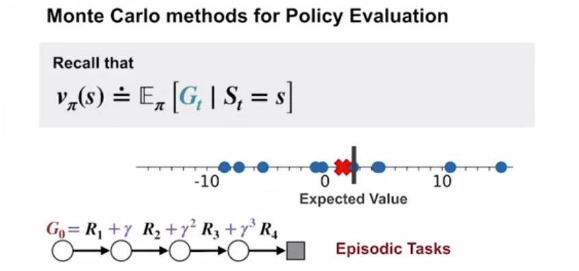

Value functions represent expected returns.  We can estimate expected returns by averaging observed returns.

With more observations, the sample average return approaches the expected return.

Returns (not rewards) can only be observed at the end of an episode, so we will focus on episodic tasks.

With bandits we evaluate the *reward* of pulling an arm.

With Monte Carlo methods, we evaluate *returns* of policies.

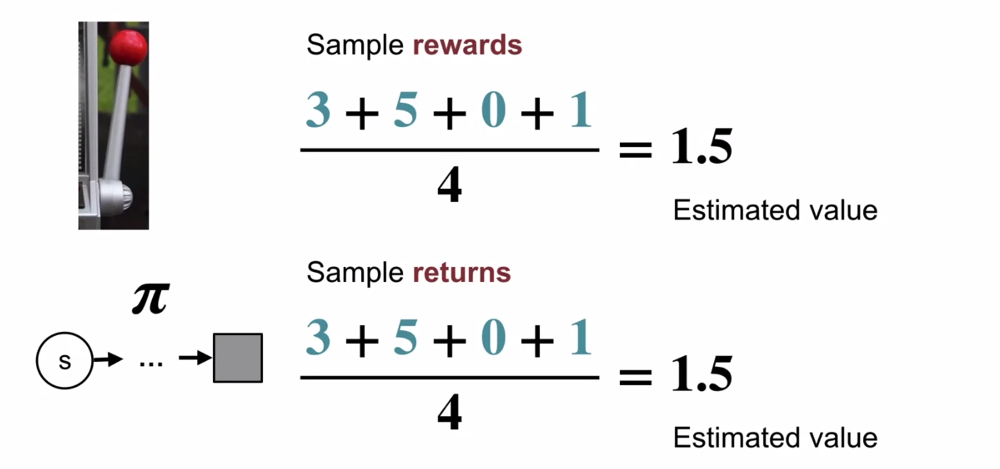

The estimated value of a state under a policy is the average of returns sampled by following that policy from the given state until termination.

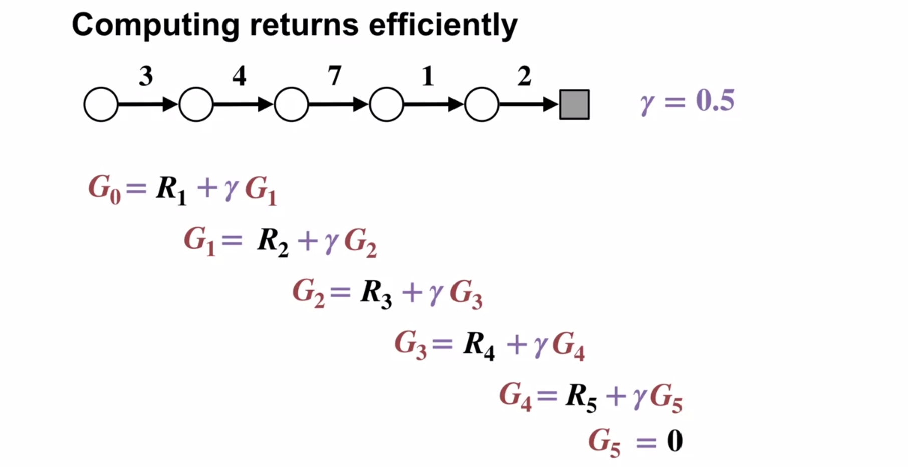

Start from the end (time $=T$) and work backwards.

The first-visit MC method estimates $v_\pi(s)$ as the average of the returns following first visits to $s$, whereas the every-visit MC method averages the returns following all visits to $s$.  Here we consider the first-visit case.

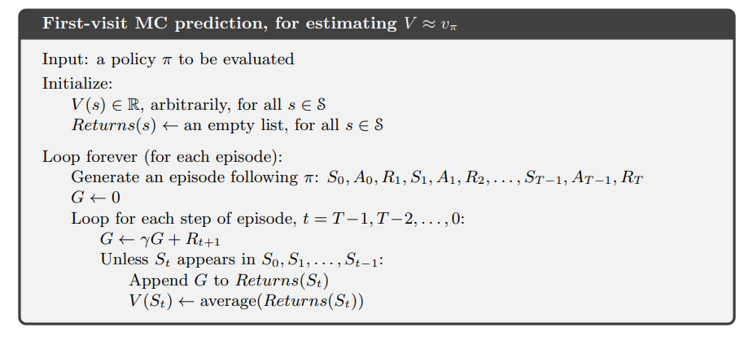

By the law of large numbers the sequence of averages of these estimates converges to their expected value. Each average is itself an unbiased estimate, and the standard deviation of its error falls as $1/\sqrt n$, where $n$ is the number of returns averaged.

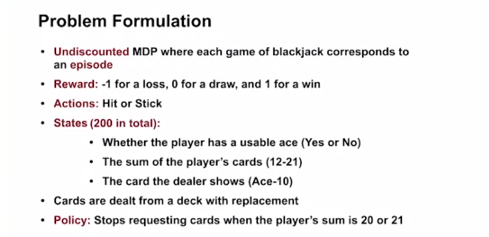

(Note the unrealistic assumption that there is replacement when cards are dealt)

Let's use Monte Carlo to learn the action-value function when the play stands on 20 or 21.

Assume $\gamma = 1$.  This means we don't need to work backwards, as there are no non-terminal rewards.

Usable ace plot is based on far fewer samples (less likelihood of being dealt one), leading to a rougher plot.

The low values for player's 17, 18, and 19 is because the policy says to hit on these totals.

#### Implications of Monte Carlo learning

* Learning is directly from experience, so there is no need to keep a large model of the environment.
* We estimate the value of a state independently of the estimates of other states.  (We don't consider the values of successor states not reached in the episode).  In DP, the value of a state always depends on the values of other states.
* The computation required doesn't depend on the size of the MDP, rather on the length of the episode. (There are no sweeps over all states)

## Lesson 2: Monte Carlo for Control
### Estimate action-value functions using Monte Carlo

State-values are insufficient to find the optimal policy - we don't have the probabilities of transitions from state to state.  Therefore we must use action-values instead.

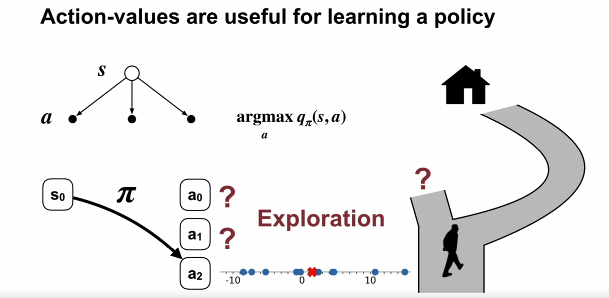

We want to learn action-values to allow us to select the action which gives the highest return.  We need to maintain an estimate of each of the possible actions to be able to select the best one.

### Understand the importance of maintaining exploration in Monte Carlo algorithms

Again, we bump into the exploitation / exploration trade-off.  Is the new road to home faster than the old?

### Apply Monte Carlo with exploring starts to solve an MDP

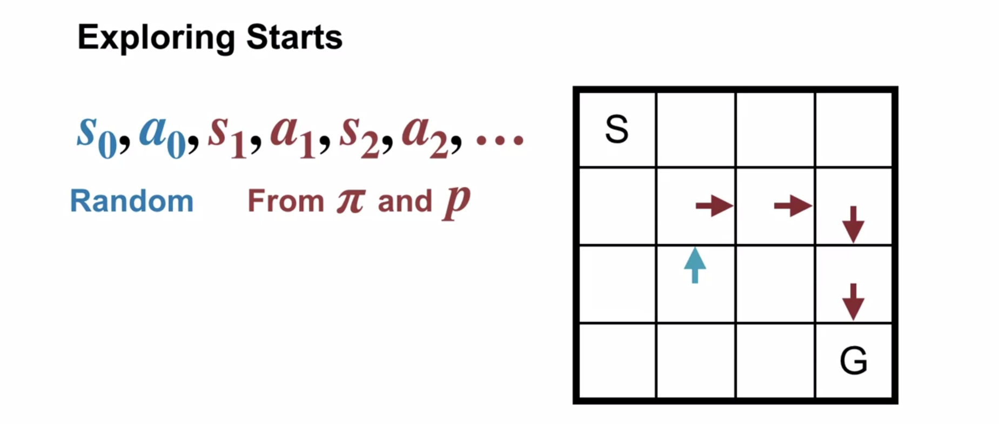

In Exploring Starts, we explore every initial state-action pair of a policy.  To do this, we must be able to set the start state, which may not always be possible.  After the first action, we follow the policy.

We specify that the episodes start in a state–action pair, and that every pair has a non-zero probability of being selected as the start. This guarantees that all state–action pairs will be visited an infinite number of times in the limit of an infinite number of episodes. We call this the assumption of exploring starts.  By the law of large numbers, the average action values will converge on their expected value.

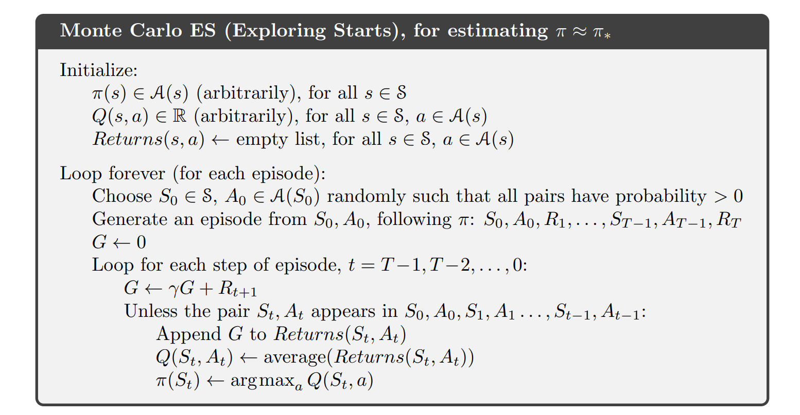

The last line of the loop is the policy improvement step.

Interestingly, the textbook says that convergence has not been formally proven, but it works in practice.

The most common alternative approach to assuring that all state–action pairs are encountered is to enforce exploration by considering only policies that are stochastic with a non-zero probability of selecting all actions in each state (eg $\epsilon$-greedy).

### Understand how to use Monte Carlo methods to implement a GPI algorithm.

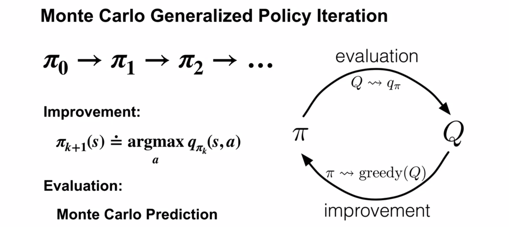

In the Evaluation step, we estimate the action-values using Monte Carlo prediction, either Exploring Starts or $\epsilon$-soft.

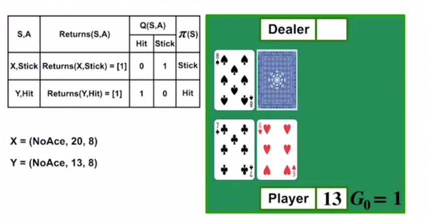

## Lesson 3: Exploration Methods for Monte Carlo
### Understand why Exploring Starts can be problematic in real problems

Sometimes it's not feasible to start in each possible state, e.g. in a self-driving car example this would be dangerous / impractical.  Exploring starts is more practical in simulated environments.

### Describe an alternative exploration method for Monte Carlo control

Given that Exploring Starts is often impractical, we use a variation of epsilon greedy to ensure exploration.

$\epsilon$-soft policies are always stochastic - all actions are taken in each state with a non-0 probability.

With a non-0 probability of each action, eventually all state-action pairs will be visited.

$\epsilon$-soft policies are defined as those for which $\pi(a|s) \ge \frac \epsilon {|\mathcal A(s)|}, \ \forall s \in \mathcal S, \ \mathrm{given}\ \epsilon \gt 0$.

$\epsilon$-greedy policies are maximally greedy $\epsilon$-soft policies, since for all *non-greedy* actions, $\pi(a|s) = \frac \epsilon {|\mathcal A(s)|}, \ \forall s \in \mathcal S, \ \mathrm{given}\ \epsilon \gt 0$.

In $\epsilon$-greedy, the greedy action gets $\pi(a|s) = 1 - \epsilon + \frac \epsilon {|\mathcal A(s)|}$.

Uniform random is $\epsilon$-soft where $\pi(a|s) = \frac 1 {|\mathcal A(s)|}, \ \forall s \in \mathcal S$.

$\epsilon$-greedy policies are also a subset of $\epsilon$-soft policies.

If the policy always gives non-zero probability to each action, it's impossible to converge to a deterministic optimal policy.

$\epsilon$-soft policies can only be used to find the optimal $\epsilon$-soft policy (which is $\epsilon$-greedy).

The best $\epsilon$-soft policy generally performs strictly worse than $\pi_*$, but performs reasonably well and allows us to avoid Exploring Starts.

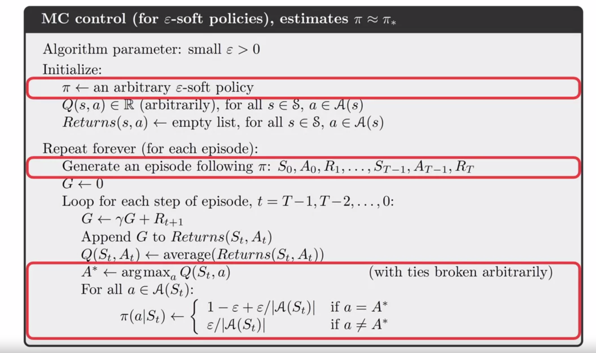

Highlighted are the changes from Exploring Starts:

1. Uniform-random can be used for initialisation.

2. The $\epsilon$-soft policy is used in the first and all subsequent time steps.

3. The new policy generated in each iteration is $\epsilon$-greedy w.r.t. the current action-value estimates. The optimal $\epsilon$-soft policy is an $\epsilon$-greedy policy.

$Q$-learning (later lessons) allows us to learn the optimal policy.

## Lesson 4: Off-policy learning for prediction

All learning control methods face a dilemma: They seek to learn action values conditional on subsequent *optimal* behaviour, but they need to behave non-optimally in order to explore all actions (to *find* the optimal actions). How can they learn about the optimal policy while behaving according to an exploratory policy? The on-policy approach in the preceding section is actually a compromise—it learns action values not for the optimal policy, but for a near-optimal policy that still explores.

On-policy methods attempt to evaluate or improve the policy that is used to make decisions, whereas off-policy methods evaluate or improve a policy different to that used to generate the data.

In the on-policy learning implicitly discussed so far, the behaviour policy is equal to the target policy.

Off-policy methods require additional concepts and notation, and because the data is due to a different policy, off-policy methods are often of greater variance and are slower to converge. On the other hand, off-policy methods are more powerful and general. They include on-policy methods as the special case in which the target and behaviour policies are the same.

Apart from addressing the exploration trade-off, learning from demonstration and parallel learning are other examples of off-policy learning.

Off-policy methods also have a variety of additional uses in applications. For example, they can often be applied to learn from data generated by a conventional non-learning controller, or from a human expert.

### Understand how off-policy learning can help deal with the exploration problem

While encouraging exploration, $\epsilon$-soft policies are suboptimal for both:
* Obtaining reward, and
* Exploring to find the best actions

The target policy (generally denoted by $\pi(a|s)$) is the one that the agent is learning (while following the behaviour policy).

The policy used to select actions (generally denoted $b(a|s)$ is called the behaviour policy, and is required to be soft (selecting all actions in all states with non-zero probability).

We evaluate and improve a *different* policy to the one used to select actions.

Generally, we want to learn the values for the optimal policy, so this is the target policy.

By behaving according to an exploratory behaviour policy, an agent gets exposure to a much larger selection of states.

The behaviour policy must "cover" the target policy, meaning that $b(a|s) > 0$ where $\pi(a|s) > 0$.  The behaviour policy needs to be able to observe returns for all paths chosen by the target policy to be able to estimate complete values for the target policy.

It follows from coverage that $b$ must be stochastic in states where it is not identical to $\pi$:  if $\pi(a|s) \ne 0$ then there must be some non-zero probability of $b(a|s)$ which is also $\ne 1$ (unless $\pi(a|s) = b(a|s) = 1$). This leads to it being exploratory.

The target $\pi$ may be deterministic, and is often the deterministic greedy function w.r.t. the current estimate of $q_\pi$, eventually becoming the deterministic optimal policy via iteration.

In this section, we consider only the prediction / evaluation problem, given an unchanging $\pi$.

### Understand importance sampling

We apply importance sampling to off-policy learning by weighting returns according to the relative probability of their trajectories occurring under the target and behaviour policies, called the *importance-sampling ratio*.

The probability of a trajectory under $\pi$ is:

$$ \begin{align}
P\{A_t, S_{t+1}, & A_{t+1}, ... ,S_T | S_t, A_{t:T-1} \sim \pi\} \\

& = \pi(A_t|S_T)p(S_{t+1}|S_t, A_t)\pi(A_{t+1}, S_{t+1}) \cdot\cdot\cdot p(S_T|S_{T-1}, A_{T-1}) \\
& = \prod_{k=t}^{T-1} \pi(A_k|S_k)p(S_{k+1}|S_k, A_k)
\end{align} $$

The importance sampling ratio is the relative probability of the trajectory under the target and behaviour policies:

$$
\begin{align}
\rho_{t:T-1} & \doteq \frac{\prod_{k=t}^{T-1} \pi(A_k|S_k)p(S_{k+1}|S_k, A_k)}{\prod_{k=t}^{T-1} b(A_k|S_k)p(S_{k+1}|S_k, A_k)} \\
& = \prod_{k=t}^{T-1} \frac{\pi(A_k|S_k)}{b(A_k|S_k)}
\end{align}
$$

If the probability of any action under $\pi$ is $0$, then the $\rho$ for that trajectory is also $0$.  Later on with the weighted importance sampling formula, this $\rho$ of $0$ contributes neither to the numerator or denominator, effectively skipping returns from episodes inconsistent with the target policy $\pi$.

To get the value under $\pi$ of a state, we multiply by $\rho_{t:T-1}$ to transform the expected value:

$$v_\pi(s) = \mathbb{E}_b[\rho_{t:T-1}G_t | S_t = s] $$

Note that $G_t$ is the return under the behaviour policy $b$, but the result is the expected return under the target policy $\pi$.

It's convenient to denote timesteps in a way which increases across episode boundaries, allowing us to reference time steps in different episodes.

If an episode reaches terminal state at $t=100$, then the next episode begins at $t=101$.

Notation:
* $\mathscr T (s)$ denotes the time steps in which state $s$ is visited for every-visit models, or the first times of visit for first-visit models.
* $T(t)$ denotes the first time step termination following time $t$.
* $G_t$ denotes the return from time $t$ through $T(t)$

The set $\{ G_t \}_{t \in \mathscr T(s)}$ are the returns that pertain to state $s$, and the set $\{ \rho_{t:T(t)-1} \}_{t \in \mathscr T(s)}$ are the corresponding importance sampling ratios (which I expect is a set of uniform values).

To estimate $v_\pi(s)$, we scale the behaviour returns by $\rho$ and average the result:

$$V(s) \doteq \frac{\sum_{t\in \mathscr T(s)}\rho_{t:T(t) - 1}G_t}{|\mathscr T (s)|}$$

The above simple average, is called *ordinary importance sampling*.

*Weighted importance sampling* uses a weighted average:

$$V(s) \doteq \frac{\sum_{t\in \mathscr T(s)}\rho_{t:T(t) - 1}G_t}{\sum_{t\in \mathscr T(s)}\rho_{t:T(t) - 1}}$$

($0$ is used if the denominator is $0$.)

In the weighted importance sampling case of a single return observed in state $s$, the sums will cancel, giving a value of $G_t$, which is a reasonable estimate, but is an expected value under $b$, not under $\pi$, and is statistically biased.  In the ordinary importance sampling case, the value is the expected value under $\pi$, but it can be extreme if the trajectory is many times more likely under $\pi$ than under $b$, with the estimate being many times times higher than the observed return, even though the episode was very representative of the target policy.

Ordinary importance sampling is unbiased.  Variance is unbounded (as $\rho$ is unbounded).

Weighted importance sampling is biased (but the bias converges asymptotically to $0$). Variance is bounded (the maximum weight on any term is $1$), and converges to $0$ assuming bounded returns.

Every-visit estimates for *both* estimators are biased, but falls to $0$ as the number of samples increases.  In practice, every-visit methods are often preferred because they remove the need to keep track of which states have been visited and because they are much easier to extend to function approximation methods.

In practice, the weighted estimator is preferred as it has drastically lower variance, but ordinary importance sampling extends to approximations.

#### Coursera slides

These slides don't take into account the whole trajectory from $s$, but rather look only at $s$ alone.

We are sampling a variable $x \sim b$, but we want to estimate: $\mathbb E_\pi[X]$.

We can't use a sample average of $x$ to compute the estimate under $\pi$ as $x$ is drawn from $b$.

The below formulae assume ordinary importance sampling:

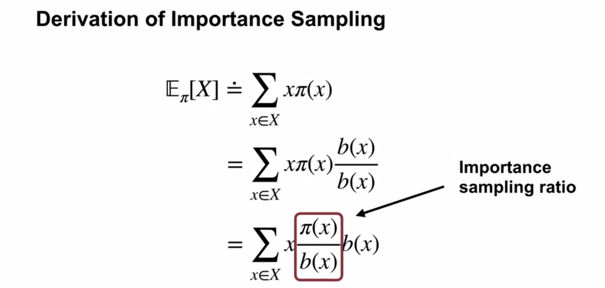

$\rho(x) = \frac {\pi(x)} {b(x)}$ is called the Importance Sampling Ratio.

We treat $x \cdot \rho(x)$ as a new random variable $X$ being sampled:

Note that $x$ is now drawn from $b$ (as desired), but estimates a value drawn from $\pi$ via $\rho$.

### Use importance sampling to estimate the expected value of a target distribution using samples from a different distribution.

With samples taken just from $b$, we got a very good estimation for the expectation under $\pi$.

### Understand how to use importance sampling to correct returns

Multiply each return observed under $b$ by $\rho$.

Ordinary importance sampling is used above (a simple average).

### Off-policy Monte Carlo control

The behaviour policy is allowed to change between or even within episodes.

$\frac{1}{b(A_k|S_k)}$ is used instead of $\frac{\pi(A_k|S_k)}{b(A_k|S_k)}$ in the estimation case, as $\pi(A_k|S_k) = 1$ since $\pi$ is a deterministic policy with ties broken consistently.

Note that that the greedy action to take propagates backwards and is based on subsequent greedy actions. The current episode is aborted if the action taken was not consistent with $\pi$ (the optimal policy under construction).

If non-greedy actions are common, then learning will be slow, particularly for states appearing in the early portions of long episodes.

There has been insufficient experience with off-policy Monte Carlo methods to assess how serious this problem is. If it is serious, the most important way to address it is probably by incorporating temporal-difference learning. Alternatively, if $\gamma$ is less than 1, then Discounting-aware Importance Sampling may also help significantly.

### Emma Brunskill: Batch Reinforcement Learning

Problem: From data on student engagement in a game with randomised levels, try to maximise length of engagement.

Getting data when it involves human interactions is difficult compared to a model where infinite data can be generated.

Using old data to make better decisions in the future.

We need to generalise from data we've seen before to create new data.

Counterfactual:  You don't know what your life would be like if you weren't reading this right now.

Causal reasoning and counterfactual reasoning are key to solving the problem.

Counterfactual or Batch Reinforcement Learning: Take old data and learn a new policy from it such that we know the value when we deploy it.

Given the probability of a trajectory decreases the longer it is, even with masses of data, it's very unlikely to have much data which has followed a non-trivial trajectory so far, to be able to choose the next best action based on past results.

Doubly robust estimators combine the best of Parametric models (low variance) and Importance Sampling (low bias)

Research includes Policy optimisation, evaluation, and error bounds for confidence in deployment.

### 5.8 Discounting aware Importance Sampling

Importance sampling covered so far doesn't allow for the structure of the composite $G_t$ being discounted.

As an example, $\gamma = 0$, the $\prod \frac {\pi(A_k|S_k)} {b(A_k|S_k)}$ will include actions after $A_t$, even though no reward comes from them.

The discounting-aware formula in this section reduce the variance coming from the cause indicated by the example above.

The sum $S$ of an infinite geometric series with $-1 \lt r \lt 1$ is given by the formula:  $S = \frac {a_1} {1 - r}$.

The weight of $R_{t+1}$ sums to $1$ by the infinite geometric series where: $a_1 = (1-\gamma)$, and $r = \gamma$:

$S = \frac {1 - \gamma} {1 - \gamma} = 1$.

### Summary

Monte Carlo methods average observed returns back-allocated to states.

Exploring starts is one way to ensure exploration, but infeasible in cases like autonomous vehicles.

Epsilon-soft policies allow us to learn the best epsilon-greedy policy, but not the optimal policy.

Off-policy learning allows us to learn from the data generated by a behaviour policy to evaluate and improve another (eg optimal) policy.

Importance sampling increases the estimate of returns for values more likely to be seen under $\pi$ (and vice-versa).

The sample average effectively contains the right proportion of each return so that in expectation it is as if the returns had been sampled under $\pi$.

[//]: # (This may be the most platform independent comment)
