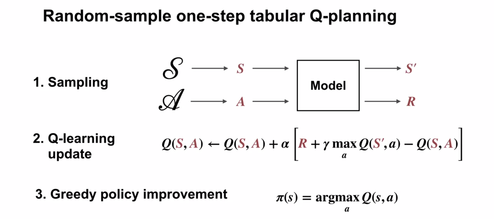
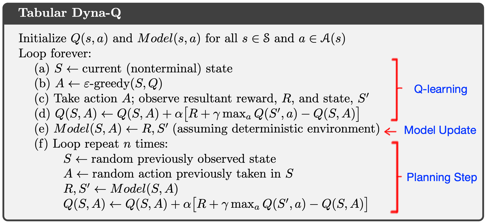
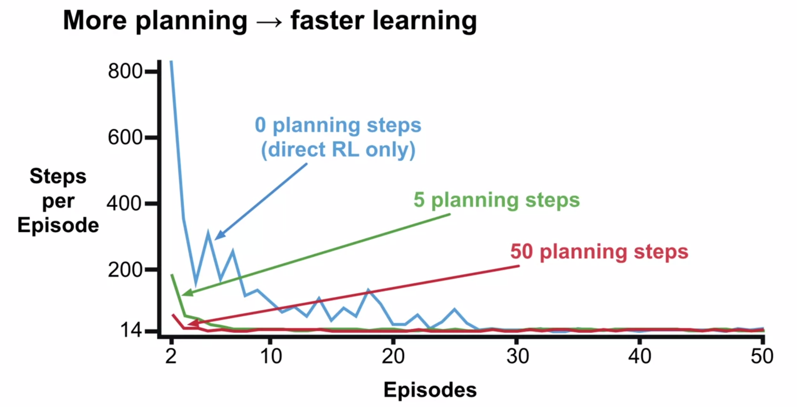
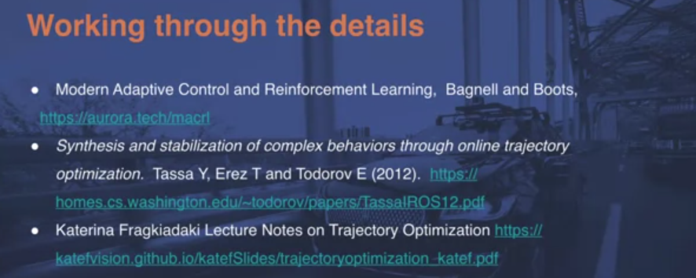

# Sample-based Learning Methods

# Week 4 - Planing, Learning and Control

## Lesson 1: What is a model?

Planning is using a model to improve a policy.

We simulate experience, then update the value function as if those experiences actually occurred.  The improved value estimates allow us to make more informed decisions via policy.

With simulated experience, fewer interactions with the world are required to generate the same policy (assuming the model continues to converge toward the real world).

We will unify the best of both model-based (DP, heuristic search) and model-free (Monte Carlo, TD) methods with the Dyna model.

Primarily, model-based methods rely on planning, whereas model-free methods rely on learning. At the heart of both is the computation of value functions.

### Describe what a model is and how they can be used

Models are used to store information about how the world works. They should produce be an accurate approximation of $p$.

Models allow us to predict an outcome of an action without having to actually take the action.

Planning is the process of using a model to improve a policy. We can simulate actions and update the value function without actually taking the action.

We can then make more informed decisions based on the simulation-updated policy with fewer actual samples taken from the real world (greater sample efficiency).

### Classify models as distribution models or sample models

#### Sample model
These produce an actual outcome drawn from some underlying probability distribution.  Eg, sampling what side a coin faces upward after a toss.  Q-learning is a sample-based learning method.

Computationally inexpensive - samples can be easily produced based on a set of rules for producing them.

The probability of each outcome need not be known.

#### Distribution model
These completely specify the likelihood of every possible outcome. Eg the complete $p$ of the MDP in Dynamic Programming.  All the information is there, no decision needs to be made, rather there is a search for the best action.

These models contain more information, but can be difficult to specify and become very large.  Every possible outcome must be enumerated with its probability, which can become combinatorially huge.

Distribution models can be used as sample models by drawing a samples based on the distribution of each outcome, but distribution models contain more information than is needed just to generate samples.

### Explain why sample models can be represented more compactly than distribution models, and their advantages and disadvantages

Consider rolling 12 dice:

#### Sample models

It's easy to generate a random int in [1...6] twelve times.

Joint probabilities are not necessary.

* Require less memory
* Can only estimate an expected outcome by averaging many samples

#### Distribution models
Calculating joint probabilities of combinations is much more work: consider all possible outcomes of a set of dice and then the probability of each.  For 12 dice, there are over 2 billion combinations to consider.

With the greater information, we can calculate an expected outcome or quantify the variability in outcomes.

* Can calculate an exact expected outcome by summing over all outcomes weighted by their probabilities.
* Can be used to assess risk accurately

## Lesson 2: Planning

"Planning with model experience" is learning without needing to interact with the world.

### Explain how planning is used to improve policies

Planning takes a model and policy and produces a better policy.

Take samples from the model, then update the value function as if those events actually happened.  Updating the policy greedily based on the updated value function will improve it also.

While actions in the real world may only be possible to take at certain times, we can fill in the waiting time (or parallelise) with learning from the simulated experience of planning.

A robot may have a model that has produces a value for falling off a cliff, and by simulating the experience it can update value function and policy to have it step away from the cliff.

### Describe random-sample one-step tabular Q-planning

Q-planning takes the experience from the model instead of the environment.

Required:
* Model simulating transition dynamics
* Strategy for sampling relevant state-action pairs

State-action pairs are sampled uniform randomly, then the model queried for the next state and reward.

#### Human planning vs planning as described

* We are able to create and update our model as part of the planning process
* The rewards and next states aren't assumed to be deterministic
* We can project ourselves into the observed behaviour and internal and external experiences of others and also learn from indirect experience

## Lesson 3: Dyna as a formalism for planning

Direct RL updates use experience from the environment to improve a policy or value function.

Planning updates use experience from a model to improve a policy or value function.

"Environment experience" can be used to learn the model, which in turn generates "model experience".

"Search control" determines the states that the agent will plan from.

#### Describe how both direct RL and planning updates can be combined through the Dyna architecture

Taking maze exploration as an example:

At the end of of the first episode, there is just one update to the state-action value of the penultimate state before the goal of the maze.

Dyna plans on every time step, but in the maze exploration first episode, planning had no impact on the policy, an initial model did get get learned.

After the completion of the 1st episode, Dyna can simulate experience from any state-action pair visited in the 1st episode. The action-value function can then be updated until convergence for all states visited on the first episode.

In the 2nd episode, Dyna can simulate experience from any state visited in the 1st or so far in the 2nd episode.  With enough planning steps, an optimal policy (based on experience so far) for each state can be determined.

In each episode, exploration continues to occur, and the policy based on the underlying action-value function would continue to improve from planning.

Random-sample one-step tabular Q-planning converges to the optimal policy for the model under the same conditions that one-step tabular Q-learning converges to the optimal policy for the real environment (each state-action pair must be selected an infinite number of times in Step 1, and $\alpha$ must decrease appropriately over time).

#### Describe the Tabular Dyna-Q algorithm

The Tabular Dyna-Q algorithm assumes deterministic transitions.  Both given a state and action, the next state and reward are assumed to always be the same.

Below, if we only do steps (a) to (d), we have an exact replica of Q-learning (direct RL).

Model learning: step (e).  This step and everything after concern model-based learning.

Inner loop:
* Search control: steps 1 & 2
* Simulated experience: step 3
* Planning update: step 4

If initial action-values are initialised uniformly, then the TD-error of many state-actions selected will be $0$. The updated values still propagate backwards from the final state, but much more quickly than using environment experience alone.

My optimisation: track states that have received learning updates, and tuples of (state-action, next-seen state). Only select state-actions from those which can transition into a state with a learned value.  Video later references section 8.4 of textbook.

#### Performance comparison of $n$ loops
Goal = +1, all other transitions = 0.  $\gamma = 0.95, \epsilon = \alpha = 0.1$. Initial action-value estimates are 0 for all agents.

Comparing Dyna-Q with 3 different amounts of planing. 50 episodes were run 30 times, averaging the results:

## Lesson 4: Dealing with inaccurate models

A model is *inaccurate* when its stored transitions are different from the environment's transitions.  The environment may change at any time.

A model is *incomplete* when it hasn't experienced transitions from all state-action pairs.  The Dyna-Q algorithm handles this case by only selecting previously seen (S, A) pairs.

### Explain the effects of planning with an inaccurate model

If the environment changes, the planning update based on one of the inaccurate transitions in the model will likely cause the TD update to move in the wrong direction.

Planning with an inaccurate model improves the value function w.r.t. the model, not the real world.

### Describe how Dyna can plan successfully with a partially inaccurate model

#### Explain how model inaccuracies produce another exploration-exploitation trade-off

In the case of a changing environment, an agent can update its model after experiencing a reward and next state.

An agent may want to double check that all its modelled transitions are correct, but checking transitions with low action-values will lead to low reward, and the environment may be constantly changing, meaning that a batch update won't be valuable.

The trade-off here is either exploring to gain accurate model updates, or assuming that the model is correct and exploiting transitions that may no longer be accurate.

After environment change, the model will remain inaccurate until the agent revisits the changed transitions.  If environment change is correlated with time, this suggests that exploration will be more valuable in transitions not recently visited.

#### Describe how Dyna-Q+ proposes a way to address this trade-off

Dyna-Q+ adds this bonus to the planning updates, making older transitions appear more valuable to follow, and the model to be updated with the latest state-action value.

If a transition has not been tried in $\tau(s,a)$ time steps, then planning updates are done as if the transition produced a reward of $r + \kappa \sqrt{ \tau(s,a)}$, for some small $\kappa$.

Additionally in Dyna-Q+:

* Actions never before taken in a previously observed state are now considered in the planning step
* The initial model for all untried actions is that they lead back to the same state with a reward of zero

With the initial maze, the increased exploration of Dyna-Q+ helps find a better policy quicker.

After the RHS shortcut opens at time step 3000, Dyna-Q+ soon finds it when the bonus becomes large enough.  Dyna-Q would eventually find it by exploring the entire state-action space with backwards propagation, which would take a long time given a large $\epsilon$.

### Drew Bagnell: Self-driving, Robotics and Model-based RL

CTO at Aurora innovation.  Interactions between robots and the world are expensive, time consuming and sometimes above risk thresholds.  Models are critical here.

Sample complexity: how many real-world samples are required to achieve high performance?  It takes exponentially fewer interactions with a model than without.

Quadratic value function approximation goes back to optimal control in the 1960s.  It's continuous in states and actions.

For linear transition dynamics with quadratic costs/rewards, it's exact.  For local convex / concave points, it is a good approximation of the true action-value function.

The approximation allows for calculating the optimal action-value in closed form (finite number of standard operations)  even with continuous actions.

Differential dynamic programming takes advantage of the technique above.

The 2nd paper is particularly clear and easy to work through for the approach just described.

## Quiz

Use [randomdict](https://github.com/robtandy/randomdict) in python for fast $\mathcal O(1)$ dictionary look-ups.

## Chapter 8 Summary

Planning, acting and model-learning interact in a circular fashion, and the processes can operate asynchronously and in parallel.  The division of computational resources is arbitrary and allocation can be based on whatever is most convenient and efficient for the task at hand.

In this chapter we have touched upon a number of dimensions of variation among state-space planning methods. One dimension is the variation in the size of updates. The smaller the updates, the more incremental the planning methods can be. Among the smallest updates are one-step sample updates, as in Dyna.

Another important dimension is the distribution of updates, that is, of the focus of search. *Prioritized sweeping* focuses backward on the predecessors of states whose values have recently changed. *On-policy trajectory* sampling focuses on states or state-action pairs that the agent is likely to encounter when controlling its environment. This can allow computation to skip over parts of the state space that are irrelevant to the prediction or control problem.

Planning can also focus forward from pertinent states, such as states actually encountered during an agent-environment interaction. The most important form of this is when planning is done at decision time, that is, as part of the action-selection process. Classical heuristic search as studied in artificial intelligence is an example of this.

Other examples are rollout algorithms and Monte Carlo Tree Search that benefit from online, incremental, sample-based value estimation and policy improvement.

## Tabular Solution Methods Summary

All of the methods we have explored so far in this book have three key ideas in common:

1. They all seek to estimate value functions
2. they all operate by backing up values along actual or possible state trajectories
3. they all follow the general strategy of generalized policy iteration (GPI), meaning that they maintain an approximate value function and an approximate policy, and they continually try to improve each on the basis of the other.

Dimensions in models:
* Sample-based vs expected (distribution model) updates. This is the "width" of the update. Sample-based methods don't need a model at all (eg TD, Monte Carlo).
* Depth of updates or degree of bootstrapping. TD - one step, Monte Carlo - the full episode.

Between 1-step TD and Monte Carlo are $n$-step methods.

Exhaustive search is in the deep and wide corner of the 2D-space. Dynamic programming is in the shallow and wide corner.  Between these two are heuristic search.

A third dimension is on- vs off-policy methods.
