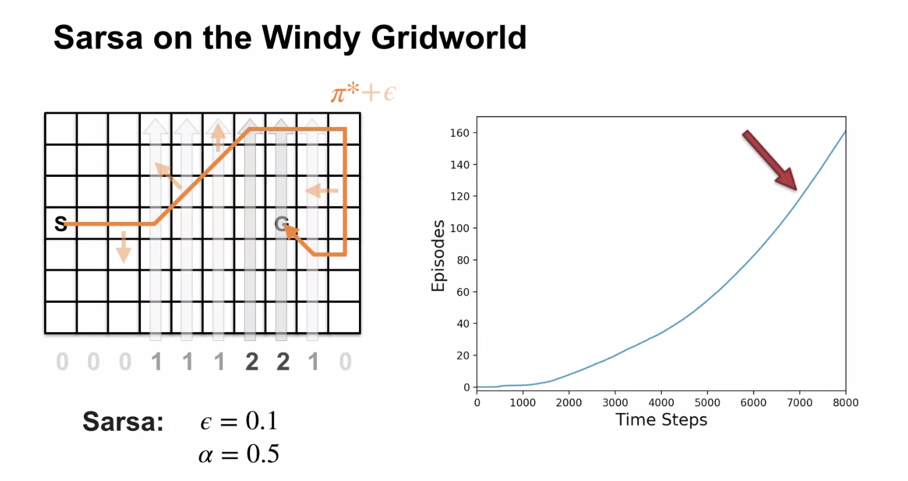
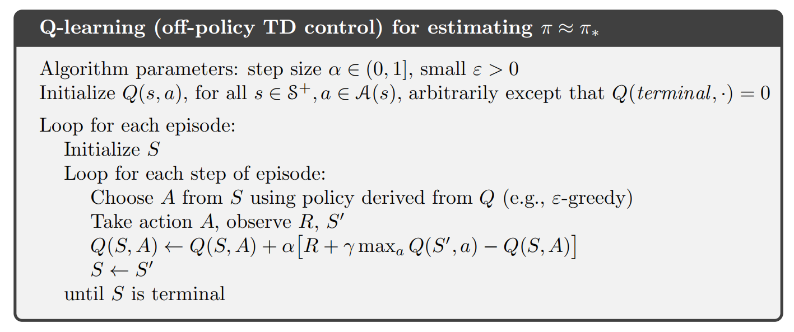
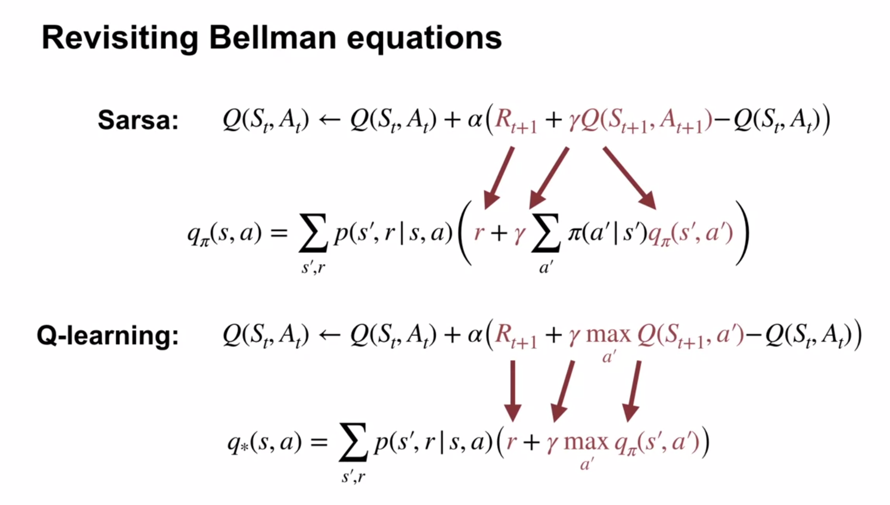
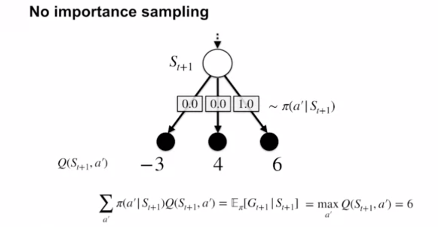
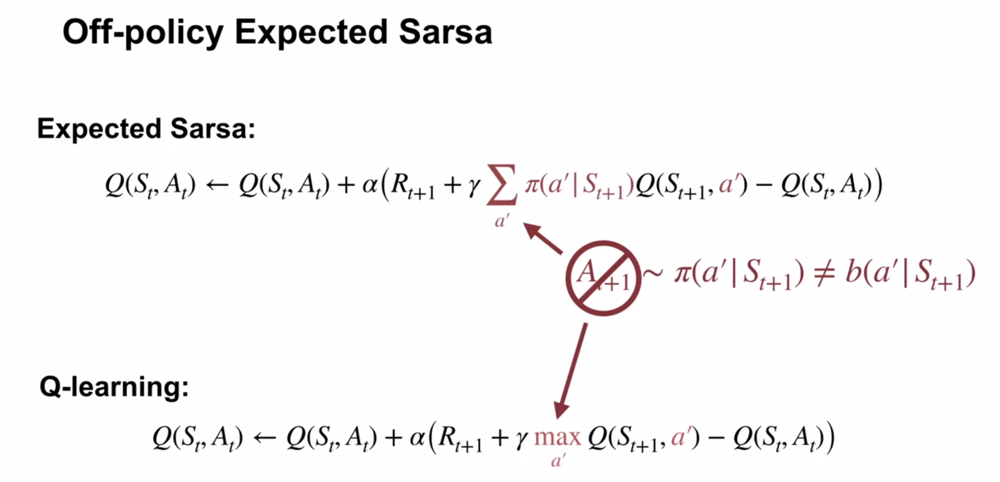
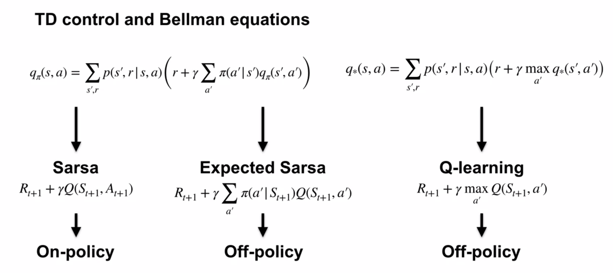
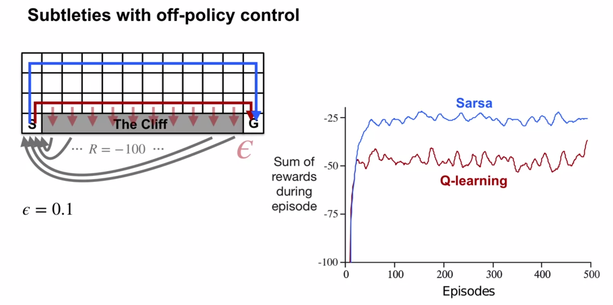

# Sample-based Learning Methods

# Week 4: Temporal Difference Learning Methods for Control

### Sarsa

Just like TD state *value* evaluation (`Recall` in the slide) required the next state to be known so that it's estimate could be looked up, with Sarsa, the next (state, action) pair must be known for it's value to be looked up.

If wind strength is 1, it will move up an additional cell more on the next state compared to zero-wind.

The plot shows the total number of episodes completed after each time step.  Results are averaged over 100 runs.

Epsilon greedy action selection was used, with $r = -1, \gamma\ = 1$ (motivates escape as fast as possible).  Initial values are optimistic, encouraging systematic exploration.

Early episodes take many more timesteps to complete than later ones.  Around 7000 steps, the $\epsilon$-greedy policy stops improving.

Monte Carlo wouldn't be a good fit - many policies don't lead to termination (eg constantly selecting "left").  Sarsa would learn such policies are bad during the episode, and switch to another one during the episode.

Sarsa is a sample-based algorithm to solve the Bellman equation for action-values.

The $\epsilon$-greedy policy won't be optimal because it will continue to explore.

### Q-learning

Q-learning was developed in 1989 and was one of the first online RL algorithms.

Q-learning is a sample-based algorithm to solve the Bellman *optimality* equation for action-values.

Unlike Sarsa, it doesn't need the next action taken - it selects the best possible next action.

Below, note the only difference from SARSA: the $max$ in the update line.  SARSA update uses the actual next action value, whereas Q-learning uses the best next action value.

The 2nd Sarsa equation above is actually the Bellman action-value equation. As it has a weighted sum over next-state-actions, it's a bit more like Expected Sarsa (read on!) than Sarsa.

Sarsa is a sample-based version of policy iteration that which uses Bellman equations for action-values, and is dependent on a fixed policy.

In contrast, because the *optimality* Bellman equation is used in Q-learning, $q_*$ is learned directly, eliminating the need for cycling between policy policy improvement / evaluation steps.

Q-learning is a sample-based version of value iteration which iteratively applies the Bellman optimality equation, which always improves the action-value function (unless already optimal).

Just like value iteration will converge on the optimal solution, Q-learning will also converge to optimality as long as it continues to explore and samples all regions of the state-action space.

### Q-learning in the windy gridworld

Q-Learning directly learns the optimal policy's action-value function. Perhaps it is more stable - the update target is based on the max of the next action-values, so it only changes when one action is better than another.

Sarsa uses the next action (even if not optimal), as part of its update target.

With a $\alpha = 0.5$, both perform similarly.
With a smaller $\alpha = 0.1$, both perform equally eventually (the gradients are parallel, episodes are completed at the same rate), but SARSA take a lot longer to catch up on rate of episode completion..

### How is Q-learning off-policy?

How can Q-learning be off-policy without using importance sampling?

Sarsa is on-policy - it bootstraps based on the actual next action-value, which is determined by the current policy.  Evaluation is on the behaviour policy.

Q-learning is off-policy - it bootstraps on the estimated best next action value, which may be different to the one of the current policy.  Exploration still happens based on an $\epsilon$-greedy policy for the current action. Evaluation is based on an estimate of the optimal (target) policy for the next state -- it learns from the estimated best action it could take, rather than the action actually taken in the next state (which we don't need to wait to know).

Whenever seeing a RL algorithm, a natural question to ask is:  "What are the target and behaviour policies?"

Below, the right branch is taken deterministically:

Q-learning's target policy is always greedy w.r.t. its current values.  It's behaviour policy can be anything that continues to visit all state-action pairs during learning (eg, $\epsilon$-greedy).

If Q-learning is off-policy, why don't we see importance sampling ratios?  It's because the agent is estimating action values with a known policy.  It doesn't need importance sampling ratios to correct for the difference in action selection.  The agent can use $\displaystyle \max_{a'} \ Q(S_{t+1}, a')$ to calculate an expected return.  Q-learning uses this technique to learn off-policy.  All non-maximal actions have probability $0$, so the expected return of a state is the same as the maximal action-value from that state.

Q-learning doesn't alternate between evaluation and improvements GPI steps, but rather learns the optimal policy directly.

There are some subtleties that make this less desirable in some specific situations.

Q-learning learns an optimal policy.  The optimal policy walks next to the cliff, but an $\epsilon$-greedy exploratory action will give a hefty -100 reward.

Sarsa learns about its current policy, which takes into account $\epsilon$-greedy action selection, and thus learns a longer but more reliable path further from the cliff.  Sarsa is able to reach the goal more reliably with a better average return.

Learning off- vs on-policy can make for differences in control, depending on the task.  For online learning, on-policy Sarsa would do better in this case.

### Expected Sarsa

Rewritten:

The Bellman equation for an action-value is a sum over next possible states, and the possible next actions in those states.

Sarsa estimates the Bellman expectation by sampling the next state from the environment, and the next action from it's policy.  But the policy dictates what action would be taken, so why bother sampling a next action?  Why not compute the expected value directly?

Expected Sarsa computes a weighted sum of next action-values to get the expected value of the next action.

The Expected Sarsa algorithm is the same as Sarsa, with the exception of the TD update target which uses the expected estimate of the next action-value rather than a sampled action-value.

In a deterministic environment, Expected Sarsa's updates will be deterministic for a given state and action, but Sarsa's will depend on the action taken in the next state (which may be a dud exploratory).

There is a huge advantage in calculating the update target: Expected Sarsa has a more stable update target than Sarsa.

Sarsa's TD update target may be in the wrong direction due to a particular sample of next action. But eventually, in expectation across multiple updates, the direction is correct.

In contrast, Expected Sarsa's update targets are exactly correct, and don't change the estimated values away from the true values.

Expected Sarsa's update targets have a much lower variance than Sarsa's.

Expected Sarsa's decreased variance comes with a downside: as the number of actions increases, the time taken to compute the expected value increases.  This average needs to be computed every time step.

### Expected Sarsa in the Cliff World

Above, $\epsilon = 0.1$ was used in all cases.  100 episodes, averaged over 50,000 independent runs.

Expected Sarsa can use larger $\alpha$ values more effectively because it explicitly averages over the randomness due to its own policy.

The environment is deterministic, so Expected Sarsa's updates are deterministic for a given state and action.

Sarsa's updates can vary significantly depending on the next action.

Above, after 100,000 episodes both algorithms have learned everything that they're going to learn.

Expected Sarsa's long-term behaviour is unaffected by $\alpha$, because in this example updates are deterministic.  The step size only determines how quickly the estimates approach their target values.

My question on this: [Why does Expected Sarsa always perform better than Q-learning?](https://www.coursera.org/learn/sample-based-learning-methods/discussions/weeks/3/threads/7l9LmThvEeuwbhKYWKHY2Q)

As $\alpha$ decreases, Sarsa's long-run performance approaches Expected Sarsa's.

Summary: Expected Sarsa learns more quickly and is more robust to larger step sizes than Sarsa.

Sarsa and Expected Sarsa both approximate the same Bellman action-value equation.

### Expected Sarsa's off-policy learning

Expected Sarsa and Q-learning both use the expectation over their target policies in their update targets, meaning that importance sampling is not required.

The expectation over actions is calculated independently of the action actually selected in the next state, which can be taken based on a behaviour policy different to $\pi$.

### How Expected Sarsa's generalises Q-learning

If the target policy $\pi$ is greedy, then only the highest value action(s) are considered in the expectation, and the $\displaystyle \sum_{a'}$ will be the $\displaystyle \max_{a'} Q(a', S_{t+1})$, giving the same result as the Q-learning formula.

Q-learning is a special case of Expected Sarsa.

### Summary

The 2nd row lists the update targets.

Sarsa learns a sample-based version of the Bellman action-value equation to learn $q_\pi$.

Expected Sarsa uses the same equation as Sarsa, but the sample is based on an expectation over the next action-values.

Q-learning uses the action-value Bellman optimality equation to learn $q_*$.

Expected Sarsa is both an on-policy and off-policy algorithm and a generalised version of Q-learning.

Sarsa can do better than Q-learning when performance is measured online.  This is because on-policy control methods account for their own exploration.

Expected Sarsa performed better than Sarsa across all step sizes measured because it mitigates the variance due to its own policy by taking the expectation over the next action.

# TODO

* Write out all formulae to test real understanding.

[//]: # (This may be the most platform independent comment)
